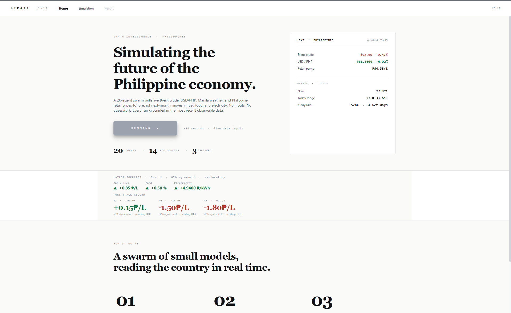

# STRATA

**An honest predictability benchmark for Philippine fuel & inflation — plus a multi-agent simulator built on top.**

Most "AI predicts the economy" claims are never tested against a hard baseline. Strata does the opposite: it measures, with a strictly-causal walk-forward backtest and significance tests, *what is and isn't* forecastable in Philippine macro data — and is blunt about the limits.

> **Validated vs exploratory — read this first.**
> - **Validated:** the **benchmark** (`ph_economic_ai/benchmark`) — strictly-causal walk-forward backtests, Diebold–Mariano tests against the *strongest* naive baseline, and split-conformal prediction intervals. Fully reproducible **without any LLM**.
> - **Exploratory:** the **multi-agent app** (the swarm, the knowledge-graph simulation, the "agent agreement" %). It's an interface and explanation layer — *not* a validated predictor. Agent agreement varies run-to-run and is **not** a calibrated probability.

## Findings — the predictability map


| Target | Setup | Verdict |
|---|---|---|
| RON95 fuel · USD/PHP · YoY inflation | 1-month forecast | **efficient** — no method beats a random walk (skill ≈ −0.01 vs RW) |
| MoM inflation (headline) | nowcast, pre-release | **predictable** — ARIMA ~+16% over the best naive (DM p = 0.001, n = 143); own short-run dynamics |
| MoM inflation (food) | nowcast, pre-release | **predictable** — ARIMA ~+16% (DM p = 0.005); own dynamics |
| **Electricity-CPI** | nowcast, driver-only | **robust within-month driver edge** — Ridge +28% over best naive (DM p ≈ 0.001, n = 151) |
| Transport-CPI | nowcast, driver-only | apparent +14.8% fuel edge **rejected** as a preliminary-data artifact |
| Food-CPI | nowcast, driver-only | clean **null** on commodity drivers |

The within-month *driver* question is answered from all three sides: a rejected false positive (transport), a confirmed null (food), and a confirmed true positive (electricity — its regulated generation charge is a formulaic, observable fuel pass-through). Full write-up: [`docs/manuscript/2026-06-10-thesis-manuscript.md`](docs/manuscript/2026-06-10-thesis-manuscript.md).

## Reproduce the benchmark (no LLM required)

```bash
pip install -r requirements.txt
python -m ph_economic_ai.benchmark.run
```

This runs the full walk-forward audit and writes artifacts to `ph_economic_ai/benchmark/artifacts/` (`accuracy_report.json`, tables, figures). No API key, no GPU, no Qt — anyone can verify the numbers above. The boundary is enforced by `tests/test_benchmark_isolation.py`, which fails if `benchmark/` ever grows a dependency on the app.

## Run the app (interactive simulator)

The app adds a 20-agent swarm + a MiroFish-style knowledge-graph simulation on top of the benchmark. It runs **fully offline on a local [Ollama](https://ollama.com)** — no API key, no quota, no internet:

```bash
pip install -r requirements-app.txt

ollama pull qwen2.5:3b        # fast tier — the 20 bulk swarm agents
ollama pull qwen2.5:7b        # deep tier — judges and synthesis
ollama pull nomic-embed-text  # RAG embeddings (optional)

python -m ph_economic_ai.main
```

Check your setup before a run:

```bash
python -c "from ph_economic_ai.engine import llm; print(llm.probe()[1])"
```

Those model sizes are deliberate. They fit in **8GB of VRAM** alongside their context; a 14b model is ~9GB and silently spills to CPU on an 8GB card, which is slow enough to look broken. If you have more VRAM, point the tiers at bigger models with the env vars below.

The app pulls live data (Brent, USD/PHP, PSA/DOE feeds), runs the swarm, and renders the simulation as a knowledge graph of what the agents actually retrieved and claimed — every node traces back to a real source.

### LLM configuration

Call sites request a **tier**, not a model, so switching provider or model is a config change rather than a code change. Setting a hosted API key switches provider automatically:

| Variable | Default | Purpose |
|---|---|---|
| `STRATA_LLM_PROVIDER` | `ollama` (or a provider whose key is set) | `ollama`, `groq`, `gemini` |
| `STRATA_LLM_FAST_MODEL` | `qwen2.5:3b` | the 20 bulk swarm agents |
| `STRATA_LLM_DEEP_MODEL` | `qwen2.5:7b` | judges and synthesis |
| `STRATA_LLM_OLLAMA_EMBED_MODEL` | `nomic-embed-text` | RAG embeddings, local |
| `OLLAMA_HOST` | `http://localhost:11434` | if Ollama runs elsewhere |
| `STRATA_OLLAMA_CONCURRENCY` | `1` | max simultaneous local calls; raise it only on a GPU with headroom |
| `STRATA_OLLAMA_CALL_DEADLINE` | `300` | seconds before a local call is treated as stalled |
| `GROQ_API_KEY` / `GEMINI_API_KEY` | unset | opt in to hosted inference |

> **Local runs are serial by default.** The swarm fans out across threads, but a single GPU can't serve many requests at once — parallel local calls just thrash VRAM and stall Ollama. Only raise `STRATA_OLLAMA_CONCURRENCY` if your card has room for several models at once. A call exceeding `STRATA_OLLAMA_CALL_DEADLINE` fails with a clear error instead of freezing the run; if that happens, restart the Ollama app to clear the underlying stall.

Embeddings are cached to `ph_economic_ai/cache/embeddings.npz` **by content hash**, so the corpus is embedded once and subsequent launches cost nothing — this is the single largest startup win, and it applies to every provider. With no embedding model available, retrieval falls back to TF-IDF and the app still runs.

**One swarm run is 39 LLM calls** — 32 on the fast tier, 7 on the deep one. `ph_economic_ai.engine.swarm.expected_call_counts()` derives that from the swarm's actual shape.

### Benchmark-conditioned anchoring (weak-model experiment)

Small local models reason about *direction* well but get *magnitude* wrong: asked for the pump-price effect of a +6.8% oil shock they answered **+₱12.93/L**, where the mechanical pass-through is about **+₱2.72/L**; food came back at **+7.6%** monthly where its own trend is under **+1%**. Rather than reach for a larger model the hardware can't hold, `engine/anchoring.py` stops asking the model for the number it can't produce and grounds each estimate in an anchor — used three ways: injected into the prompt as a **prior**, applied as a **leash** that clamps a drifting estimate back toward the anchor while keeping its direction, and used as a **fallback** when the model produces nothing (so a sector is never blank). The report shows which of the three happened.

The novel part is that **each sector is anchored to the signal its own walk-forward backtest found real** — the anchors differ in *kind*, not just value:

| Sector | Benchmark verdict | Anchor |
|---|---|---|
| **Fuel** | informationally efficient (RW wins) | mechanical oil→pump pass-through — a *scale*, not a forecast |
| **Electricity** | predictable via a formulaic fuel pass-through (Ridge +28%, DM p ≈ 0.001) | fuel→generation-charge pass-through — a *validated* physical signal |
| **Food** | clean null on commodities, but predictable own-dynamics (ARIMA +16%) | trailing own-trend **persistence** — deliberately *not* a commodity pass-through |

Anchoring food to oil would be anchoring it to what the backtest proved is noise; anchoring it to its own recent trend is what the backtest says is informative. This couples the exploratory swarm directly to the validated benchmark. Verified live on 8GB hardware: with anchors injected, `qwen2.5:7b` returned **+₱2.91/L** for fuel and a food agent returned **+0.77%** — each its own refinement of the physical/statistical baseline, where the un-anchored model had produced ₱12.93 and 7.6%. This makes the exploratory layer physically coherent; it does **not** claim to beat the random-walk baseline, which the benchmark shows nothing does at one month.

## Screenshots

| Workbench (report + interact) | Knowledge-graph simulation | Landing |
|---|---|---|
|  |  |  |

*(Drop PNGs into `docs/img/` to populate these.)*

## Repo layout

```
ph_economic_ai/
  benchmark/   # the validated, reproducible audit (walk-forward, DM tests, conformal)
  engine/      # swarm, debate, RAG, knowledge graph, trust store
  ui/          # PyQt6 app — landing, workbench (report+interact), simulation canvas
docs/
  manuscript/  # the thesis write-up
```

## How to cite

> Sindous (2026). *Strata: An honest predictability benchmark for Philippine fuel and inflation.* https://github.com/sindoussss/ph-economic-pressure-ai

## License

MIT — see [LICENSE](LICENSE).
