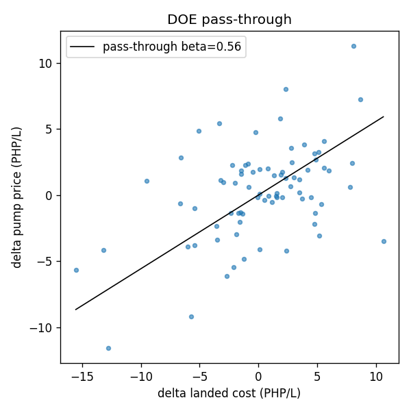
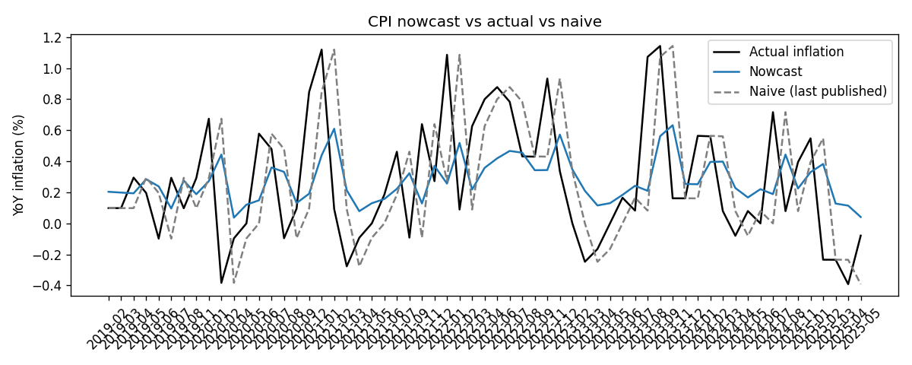
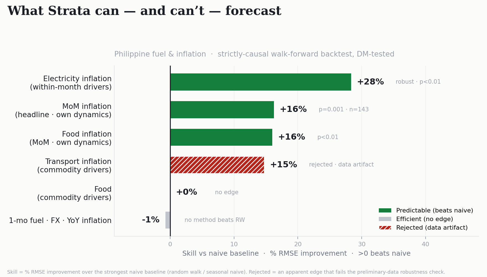
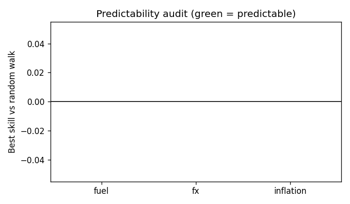

# Forecastable or Efficient? A Reproducible Predictability Audit and Nowcast of Philippine Fuel, FX, and Inflation

**Author:** Sindous
**Draft:** 2026-06-10 · grounded in the frozen `ph_economic_ai/benchmark/artifacts/accuracy_report.json` and companion tables.
**Status:** Draft. All empirical values are taken verbatim from committed artifacts; the §1.1 macro figures (2022–2025 episode) are drawn from PSA and BSP releases, cited under *Primary institutional and data sources* in the References (specific release reference numbers to be confirmed in the final version).

---

## Abstract

Claims that machine learning or multi-agent AI systems can "predict the economy" are common and rarely tested against a hard baseline. This thesis asks a narrower, answerable question for the Philippine case: can standard methods forecast monthly fuel prices, the peso–dollar exchange rate, and inflation better than naive persistence — and if a series resists forecasting, can the official figure at least be *nowcast* before its release? I build a small, fully reproducible benchmark that evaluates every claim with a strictly causal walk-forward backtest, a seven-method forecaster panel, Diebold–Mariano significance tests against the *strongest* simple baseline, and split-conformal prediction intervals. The result is a **predictability map**. One-month-ahead forecasts of premium gasoline (RON95), USD/PHP, and year-on-year inflation are **informationally efficient**: no method significantly beats a random walk — a null the accompanying power analysis bounds to a ~25% minimum detectable effect, so it rules out a large exploitable edge rather than every edge — reproducing Meese–Rogoff (FX) and Atkeson–Ohanian (inflation) for an emerging market. The single genuine positive is a **nowcast of month-on-month inflation**: using within-month observable oil, FX, and fuel data plus the previous print, an ARIMA model beats the strongest naive baseline by 16.2% (Diebold–Mariano p = 0.032, n = 61), a result that strengthens to 16.3% (p = 0.001, n = 143) on a longer 2007–2026 sample spanning the global financial crisis and COVID. A driver-only ablation shows this edge comes from inflation's own short-run dynamics, not a statistically significant contemporaneous-driver signal. Component-level tests then probe the within-month *driver* channel from three directions. A transport nowcast shows an apparently significant fuel edge (+14.8%, p = 0.021) that the robustness check exposes as an artifact of three preliminary data points and rejects. A food nowcast yields a clean, stable null on its commodity drivers (while independently reproducing the own-dynamics positive, ARIMA +16%, p = 0.005). An electricity nowcast yields a **robustly significant driver edge** (Ridge +28%, DM p ≈ 0.001, stable across both sample halves and earlier cutoffs) — because the regulated Meralco generation charge is a formulaic, within-month-observable fuel pass-through. The same protocol thus *rejects* a false positive, *confirms* a null, and *confirms* a true positive: the within-month driver channel is exploitable precisely where the pass-through is mechanical (electricity), and not where prices are locally determined (food) or the apparent signal is fragile (transport). The contribution is methodological as much as empirical: an honest, reproducible protocol that separates what is forecastable from what is efficient in a data-poor economy, and that bounds its one positive finding rather than overstating it. A companion contribution turns the map outward: it conditions a program-aided *anchoring* layer that lets a small, offline language-model system produce physically coherent estimates on commodity hardware — each series anchored to the signal its own backtest identified, and each anchor regressed against the same real data, so that the one anchor that predicts (fuel, correlation 0.60 against realized pump changes) is distinguished from the two that only guard magnitude (electricity, food) rather than presented as uniform successes.

---

## 1. Introduction

### 1.1 Motivation
Fuel and food prices, and the inflation they feed, dominate Philippine household budgets and monetary-policy debate — never more visibly than during the 2022–2025 period that motivates this study. The Russian invasion of Ukraine in February 2022 drove world crude and refined-product prices to multi-year highs, and because Philippine pump prices have been market-determined since the Downstream Oil Industry Deregulation Act of 1998 (Republic Act 8479) — adjusted on a near-weekly cycle that tracks Mean of Platts Singapore quotations — the shock passed quickly to the pump, lifting gasoline and diesel to record levels by mid-2022 and prompting targeted fuel subsidies for the transport sector (e.g. the *Pantawid Pasada* programme). Excise taxes on petroleum products, raised in tranches under the 2018 TRAIN Law (Republic Act 10963), kept retail prices structurally elevated; proposals to suspend them during the 2022 spike were debated but not enacted.

The pass-through to consumer prices was rapid. Headline CPI inflation climbed through 2022 (averaging 5.8% for the year) to **8.7% year-on-year in January 2023** — its highest since November 2008, a roughly fourteen-year peak — well above the Bangko Sentral ng Pilipinas (BSP) target band of 2–4%, with food and fuel-intensive components among the largest contributors. The BSP responded by raising its policy rate from **2.0% to 6.50%** in a sequence of hikes from May 2022 through October 2023 (a cumulative 400 basis points). Inflation then receded: the annual average eased from 6.0% in 2023 to **3.2% in 2024** (back inside the 2–4% target) and further to about **1.7% in 2025** — below the band, the lowest in nearly a decade. Throughout, the monthly inflation print released by the Philippine Statistics Authority (PSA) was a closely watched signal that moved expectations and framed each BSP decision.

In that environment, a credible ability to anticipate next month's fuel price or inflation rate — even by the short interval between the close of within-month data and the official PSA release — would be valuable to households, firms, and the central bank. This is the practical question the thesis makes precise and tests. *(Sourced from PSA and BSP releases — Jan-2023 peak 8.7% [PSA CPI, highest since Nov-2008]; annual averages 5.8/6.0/3.2/1.7% for 2022–2025 [BSP]; policy rate 2.0%→6.50% by Oct-2023 [BSP]; target band 2–4% — cited under Primary institutional and data sources in the References.)*

### 1.2 The gap
A wave of applications — including multi-agent "swarm" and large-language-model systems — claim to forecast prices or "the economy," but almost none report a like-for-like comparison against the simplest defensible benchmark: assuming next month looks like this month. Without that comparison, an impressive-looking forecast says nothing. The prior question is therefore not "how good is the model?" but "is this series forecastable at all, relative to naive persistence — and how would anyone know?"

### 1.3 Research questions
- **RQ1.** Can standard methods forecast one-month-ahead PH fuel, FX, and year-on-year inflation better than a random walk?
- **RQ2.** If forecasting fails, what mechanism explains the efficiency?
- **RQ3.** Can the official inflation figure be *nowcast* before its release, and is any edge an information-timing effect or a time-series-dynamics effect?
- **RQ4.** Is any positive result robust to a larger, more varied sample?

### 1.4 Contributions
1. A small, fully reproducible benchmark (`ph_economic_ai/benchmark/`) that turns "is it accurate?" from an assertion into a re-runnable measurement.
2. A **predictability map** of Philippine macro series: a clean boundary between the efficient (unforecastable beyond naive) and the forecastable.
3. A genuine positive: a month-on-month inflation nowcast that beats the strongest naive baseline, significance-tested and robustness-checked.
4. A discipline of *honest bounding*: removing fabricated confidence, requiring a beat over the strongest baseline, using ablation to attribute the win to a mechanism rather than overclaiming, and correcting for multiple comparisons — under which the headline positives (electricity, long-sample MoM inflation, food) survive the strict Bonferroni family-wise bound.
5. A companion application contribution — **benchmark-conditioned anchoring** (§6.6): a program-aided method that makes a small, offline language-model system produce physically coherent estimates by anchoring each series to the signal its *own* backtest identified, with every anchor regressed against the same real data and honestly separated into a validated pass-through predictor (fuel) and magnitude guards that do not forecast (electricity, food).

### 1.5 Roadmap
Section 2 reviews efficiency, nowcasting, and forecast-evaluation literature. Section 3 documents data and the fuel-proxy validation. Section 4 details the methodology. Section 5 reports results. Section 6 discusses the efficient-vs-forecastable boundary, the role of honesty as method, and the application of the predictability map to an offline anchoring layer (§6.6). Section 7 concludes.

---

## 2. Background and Literature Review

This thesis sits at the intersection of four literatures: market efficiency and the random-walk benchmark, the predictability of inflation, nowcasting, and the statistics of forecast evaluation and uncertainty quantification. Each supplies a piece of the protocol used here, and each frames a specific way the empirical claims could be wrong. The review proceeds from the benchmark this thesis must beat, through the one setting where beating it is plausible, to the tools that decide whether a "beat" is real.

### 2.1 Market efficiency and the random-walk benchmark
The conceptual anchor is the efficient-market hypothesis (Fama, 1970): if prices already incorporate available information, future changes are unforecastable from that information, and the best predictor of tomorrow is today. In forecasting practice this becomes the random walk — a deceptively strong benchmark. The canonical demonstration is Meese and Rogoff (1983), who found that structurally-motivated exchange-rate models fail to beat a random walk out of sample at short horizons, despite using realized values of their own regressors. Four decades of re-examination have left the result largely intact: Cheung, Chinn and Pascual (2005) reconfirmed it across model classes and currencies, and the survey by Rossi (2013) concludes that exchange-rate predictability, where it exists, is fragile and horizon- and period-dependent. The lesson is not that markets are literally efficient but that the random walk is an *empirically* high bar; beating it requires genuine, stable, exploitable structure rather than in-sample fit. Accordingly, this thesis treats the random walk and its near-relatives — drift and seasonal-naive — as the family of baselines every candidate method must clear, and reports the *strongest* of them as the bar (Section 4.7).

### 2.2 Inflation forecasting and the naive benchmark
A parallel result holds for inflation. Atkeson and Ohanian (2001) showed that elaborate Phillips-curve forecasts struggle to beat a naive forecast that simply projects recent inflation forward, prompting a large literature on *why* inflation became "hard to forecast" (Stock and Watson, 2007) and on the conditions under which any model adds value (the survey of Faust and Wright, 2013). The common thread is persistence: a highly autocorrelated series leaves little for a model to add beyond its own lag. This thesis takes that thread literally and turns it into a testable mechanism. Year-on-year inflation is an overlapping twelve-month difference, so consecutive observations share eleven months of information and the naive forecast is mechanically excellent; the month-on-month transform removes that overlap and exposes whatever short-run dynamics remain. The framing in which a series is measured, not the series itself, can therefore determine whether it appears forecastable — a point the empirical results (Section 5.3) make concrete.

### 2.3 Nowcasting
Forecasting and *nowcasting* are distinct problems often conflated in applied "AI predicts the economy" work. Nowcasting (Giannone, Reichlin and Small, 2008; Bańbura, Giannone, Modugno and Reichlin, 2013) estimates a target *before its official release* by exploiting information that is already observable within, or shortly after, the reference period — the "real-time data flow." Related contributions include Evans (2005) on real-time GDP and the mixed-frequency activity index of Aruoba, Diebold and Scotti (2009); the review by Bok et al. (2018) synthesizes the field. The crucial conceptual point is that a nowcast edge is one of *information timing*, not of beating an efficient market: for a given calendar month, world oil, the exchange rate, and retail fuel are observable before the Philippine Statistics Authority publishes that month's CPI. A nowcast that beats persistence is therefore not a violation of efficiency but an exploitation of publication lag — a weaker, and far more defensible, claim. This distinction is the hinge of the thesis (RQ3): it is precisely where, if anywhere, a genuine positive result should be found, and it disciplines the interpretation of the one that is.

### 2.4 Evaluating and comparing forecasts
A lower error in one sample can be noise. Diebold and Mariano (1995) formalized the comparison with a test of equal predictive accuracy based on the loss-differential series; Harvey, Leybourne and Newbold (1997) supplied the small-sample correction used throughout this thesis, and West (1996) developed the asymptotics for predictive inference. A known subtlety is that the standard Diebold–Mariano test is designed for *non-nested* models; when one model nests the benchmark — as a model that can collapse to a random walk does — the test is conservative, and Clark and West (2007) propose an adjusted statistic. The retrospective by Diebold (2015) clarifies the test's intended scope. This thesis compares distinct method classes (e.g. ARIMA versus random walk) and applies the HLN-corrected Diebold–Mariano test as the arbiter of every "beats"/"efficient" verdict, treating raw RMSE ordering as suggestive only; the conservativeness under near-nesting biases *against* false positives, which suits an audit whose priority is not to overclaim.

### 2.5 Distribution-free uncertainty
Honest forecasts require honest intervals. Conformal prediction (Vovk, Gammerman and Shafer, 2005; Shafer and Vovk, 2008) constructs prediction sets with finite-sample coverage guarantees under the sole assumption of exchangeability, without distributional or model-correctness assumptions; the split-conformal variant (Lei et al., 2018) makes this computationally trivial for a fitted regressor, and the tutorial of Angelopoulos and Bates (2023) gives the modern treatment. This machinery replaces the ad hoc — or, in the application this thesis grew out of, *fabricated* — "confidence" numbers common in deployed tools with intervals whose empirical coverage is measured and reported alongside the nominal level (Section 5.1). Where exchangeability is strained by time-series dependence, the reported coverage is treated as approximate and disclosed as such, rather than asserted.

### 2.6 Forecast accuracy measures and combination
Comparing errors across series of different scales motivates scale-free measures; this thesis uses the Mean Absolute Scaled Error (Hyndman and Koehler, 2006) alongside RMSE, MAE, MAPE and an explicit skill score, skill = 1 − RMSE_model / RMSE_baseline. Because the evaluation runs a panel of methods rather than a single model, the forecast-combination literature is also relevant: Bates and Granger (1969) established that combinations often dominate their constituents, and the survey of Timmermann (2006) catalogues when and why. Here the panel is used diagnostically — to locate the best honest competitor to the baseline — rather than to manufacture a winner by combination, but the literature motivates reporting the full panel rather than a single hand-picked model.

### 2.7 Philippine context
Two institutional facts make the Philippine case tractable. First, under the Downstream Oil Industry Deregulation Act (Republic Act 8479, 1998), domestic fuel pricing is deregulated and oil companies adjust pump prices on a near-weekly cycle that tracks world product prices (Mean of Platts Singapore, and Brent as a proxy) with a short lag. The pass-through literature — "rockets and feathers" (Bacon, 1991; Borenstein, Cameron and Gilbert, 1997) — documents that such retail prices follow upstream costs partially and asymmetrically, which is exactly the partial, lagged pass-through estimated in Section 5.2 and the mechanism behind the efficiency of the fuel series. Second, the Philippine Statistics Authority releases the Consumer Price Index on a fixed monthly calendar and publishes commodity-group detail (including Transport) through OpenSTAT, with recent vintages marked preliminary and subsequently revised — a feature that proves decisive for the Transport-CPI robustness result (Section 5.5). The gap this thesis fills is the absence, for Philippine macro series, of a reproducible and honestly-bounded predictability audit: most fuel- or inflation-"prediction" work in this space, including recent multi-agent and large-language-model systems, reports no like-for-like comparison against the naive benchmark and no out-of-sample significance test, and is therefore not assessable as a forecasting claim at all.

---

## 3. Data

All series are committed as CSVs and regenerable via `refresh_data.py`; the benchmark reads only frozen files, so every number is reproducible offline.

### 3.1 Fuel (ground truth)
Premium gasoline (RON95), monthly PHP/litre, from the World Bank **Global Fuel Prices Database** (Open Database License). The committed gold series underpins the one-month forecast backtest over **2019-11 to 2025-03 (n = 79 months)**.

### 3.2 Exchange rate
USD/PHP monthly from Yahoo Finance (`PHP=X`).

### 3.3 Inflation
Philippine CPI from the IMF **International Financial Statistics** via DBnomics, transformed to year-on-year (YoY) and month-on-month (MoM) inflation.

### 3.4 Predictors
Brent crude (`BZ=F`), USD/PHP (`PHP=X`), an RBOB-gasoline→PHP landed-cost proxy (`RB=F`), and a seasonal demand index. Two feature panels are built: a standard ~10-year window and a **long window (Yahoo `max`, 2007–2026, 177 months)** used for the robustness re-test.

### 3.5 Fuel-proxy validation
Because high-frequency retail RON95 is not freely available as a long gold series, an RBOB-derived proxy is validated against the World Bank gold: Pearson **r = 0.91** with a mean bias of **−₱5.88/L** (disclosed, not corrected away). The proxy is fit for *directional/relative* validation, a stated limitation.

### 3.6 Reproducibility
`python -m ph_economic_ai.benchmark.run` regenerates every artifact (report, ablation, efficiency panel, pass-through, audit, YoY and MoM nowcasts, driver ablation, longer-sample confirmation, and figures) from the committed CSVs.

---

## 4. Methodology

### 4.1 Causal walk-forward backtest
The validity foundation. At each step t, models train only on data through t and predict t+1 (expanding window, minimum train = 24 months). A leakage-guard test asserts no future information enters any feature. This is what makes the accuracy claim defensible rather than in-sample.

### 4.2 Forecaster panel
Seven methods: random-walk, drift, seasonal-naive, ARIMA(1,1,1), ETS (additive trend), Ridge regression, and HistGradientBoosting. The first three are baselines; the last four are candidates.

### 4.3 Metrics
MAE, RMSE, MAPE, MASE, and skill = 1 − RMSE_model/RMSE_baseline.

### 4.4 Significance
Diebold–Mariano with the Harvey–Leybourne–Newbold small-sample correction. A method "beats" a baseline only if it has lower RMSE *and* DM p < 0.05; otherwise the verdict is "efficient"/"no better than naive."

### 4.5 Calibrated uncertainty
Split-conformal intervals at nominal 50/80/90/95%, with an empirical-coverage calibration table reported alongside the nominal levels.

### 4.6 Forecasting vs nowcasting
Forecasting uses only information available *before* the reference month (lagged features + previous value). Nowcasting adds *within-month observable* drivers (contemporaneous oil/FX/fuel) plus the previous print — modelling the real situation in which those inputs are known before the PSA release. An eligibility rule keeps only genuinely pre-release information.

### 4.7 Baseline discipline (the hollow-win guard)
A candidate must beat the *strongest* of {random-walk, seasonal-naive, drift}, not the weakest. This prevents a "win" that merely clears a baseline no one would use; it is enforced in code and unit-tested.

### 4.8 Ablation and robustness
A **driver-only ablation** drops the own-lag (previous MoM) and restricts candidates to the driver regressors, isolating any within-month information edge from time-series dynamics. A **longer-sample re-run** rebuilds features on the 2007–2026 window and repeats the MoM nowcast and ablation.

### 4.9 Multiple comparisons
Because the audit conducts several confirmatory Diebold–Mariano tests — each of the form "beats the strongest naive baseline" — testing them at α = 0.05 individually inflates the family-wise false-positive rate. The confirmatory family is the six tests that return a `beats_best_naive` verdict with a computable p-value (headline MoM at both samples, food MoM, electricity MoM, the electricity within-month driver, and the transport within-month driver); the efficiency findings are excluded, since accepting a null raises a power question (quantified in §5.1), not a false-positive one. Two corrections are applied and reported (`multiple_testing.json`, regenerated by `benchmark.multiple_testing`): the **Bonferroni** procedure controlling the family-wise error rate (the strictest), and the **Benjamini–Hochberg** step-up controlling the false-discovery rate. Both the individual and the adjusted p-values are reported, so a claim's status under each regime is explicit rather than left to the reader (§5.8).

### 4.10 Integrity infrastructure
The fabricated "90% confidence" from the original application was removed and replaced with the conformal interval. A frozen `accuracy_report.json` plus a hash-chained, two-phase track record make results tamper-evident and quotable.

---

## 5. Results

### 5.1 One-month forecasting is efficient (RQ1)

**Fuel.** Over n = 79, the best ML model (HistGradientBoosting) has RMSE 4.099 vs the random walk's 4.069 — a skill of **−0.0075**: no improvement. Against the seasonal-naive baseline the model's skill is +0.64, i.e. the gain is over a *bad* baseline, not the strong one.

On the efficiency panel (n = 52), no method significantly beats the random walk:

| Method | RMSE | Skill vs RW | DM p vs RW |
|---|---|---|---|
| random_walk | 4.069 | 0.000 | — |
| drift | 4.110 | −0.010 | 0.504 |
| ETS | 4.183 | −0.028 | 0.275 |
| Ridge | 4.105 | −0.009 | 0.881 |
| **HGB** | **4.099** | **−0.008** | **0.921** |
| ARIMA | 4.383 | −0.077 | 0.037 (worse) |
| seasonal_naive | 11.497 | −1.826 | 0.0001 (worse) |

The ML methods are statistically *indistinguishable* from the random walk (DM p ≈ 0.88–0.92); ARIMA and seasonal-naive are significantly worse. No method beats the random walk at the one-month horizon.

**Power — what "efficient" can and cannot mean here.** Accepting the null on a modest sample is only informative if the test could have rejected it, so the efficiency verdict is bounded by a power analysis (`power.json`). For the fuel forecast, the minimum skill the Diebold–Mariano test could detect at 80% power (α = 0.05) is **≈ 25%** RMSE improvement over the random walk; the observed skill is −0.3%. The honest reading is therefore **"no economically-large edge (≳ 25%) is detectable at this sample size,"** not "predictability is proven absent" — the test rules out a large, exploitable edge but cannot exclude a small one. This is the same bound Meese–Rogoff-style results carry and rarely state; here it is quantified.

**The predictability audit** extends this verdict across targets:

| Target | n | Verdict |
|---|---|---|
| Fuel (RON95) | 52 | no detectable edge over RW (efficient to a ~25% MDE) |
| USD/PHP | 38 | no detectable edge over RW |
| Inflation (YoY) | 59 | no detectable edge over RW |

All three show no detectable edge — reproducing Meese–Rogoff (FX) and Atkeson–Ohanian (inflation) for the Philippines, subject to the power bound above (which is tightest for the smallest samples, USD/PHP at n = 38).

**Calibration (fuel forecast).** The conformal intervals (half-widths ₱2.56/5.88/10.42/11.86 at 50/80/90/95%) over-cover at the upper levels (measured coverage 0.58, 0.88, 1.00, 1.00 at n = 79) — i.e. conservative, honestly reported rather than tuned.

### 5.2 Mechanism (RQ2)
A pass-through regression of the RON95 change on contemporaneous and lagged driver changes (n = 77) gives β₀ = 0.31, β₁ = 0.24, **total pass-through β = 0.56**, R² = 0.33, with a near-zero driver autocorrelation (ACF₁ = 0.16). Interpretation: domestic fuel reflects a *partial, lagged* pass-through of a driver (world product price) that is itself close to a random walk. A predictable level built on an unpredictable, near-random-walk driver is exactly what produces an efficient series — the mechanism behind RQ1.

The Phase-2 gated feature ablation selected the `passthrough_lags` variant as the best-justified specification; it still did not beat the random walk, but it closed the model-vs-RW gap and tightened intervals.

**Figure 1.** Estimated pass-through of contemporaneous and lagged driver changes to the monthly RON95 change (total β = 0.56, R² = 0.33). A partial, lagged pass-through of a driver that is itself close to a random walk is the mechanism behind the fuel series' efficiency.

### 5.3 Nowcasting (RQ3)

**YoY nowcast.** Adding within-month oil/FX/fuel plus the previous print, before the PSA release, still yields **no_better_than_naive** (n = 61). Year-on-year inflation overlaps 11 of 12 months with its prior value, so persistence is mechanically near-unbeatable.

**MoM nowcast — the numeric "yes."** Targeting month-on-month inflation, the honest bar is to beat the strongest of {random-walk, seasonal-naive, drift} by a DM test. The result is **beats_best_naive**:

| Method | RMSE (n = 61) |
|---|---|
| ARIMA | **0.380** |
| Ridge | 0.398 |
| ETS | 0.414 |
| random_walk (best naive) | 0.453 |
| drift | 0.458 |
| HGB | 0.457 |
| seasonal_naive | 0.534 |

ARIMA beats the random walk by **+16.2% skill, DM p = 0.032**. Month-on-month inflation carries genuine within-month signal that the annual frame hides.

**Figure 2.** Month-on-month inflation nowcast (n = 61): ARIMA (own-dynamics) versus the random-walk baseline against the realized pre-release actual. The ARIMA edge (+16.2%, DM p = 0.032) strengthens to +16.3% (p = 0.001) on the 2007–2026 sample (§5.4).

**Driver-only ablation.** Dropping the own-lag and restricting to driver regressors gives **driver_edge = False** (n = 61): driver-only Ridge (RMSE 0.399) is directionally better than the random walk (0.453, −12%) but does not clear DM significance. The MoM win is therefore attributable to inflation's **own short-run dynamics** (captured by ARIMA), with the contemporaneous-driver edge suggestive but not significant.

### 5.4 Robustness (RQ4)
Rebuilding features on the 2007–2026 window (n = 143, spanning the GFC, the 2014 oil crash, and COVID) and re-running:

| Metric | n = 61 | n = 143 |
|---|---|---|
| MoM verdict | beats_best_naive | beats_best_naive |
| best method | ARIMA | ARIMA |
| skill vs best naive | +16.2% | **+16.3%** |
| DM p | 0.032 | **0.001** |
| driver_edge | False | False |

The MoM win **holds and strengthens** (p tightens from 0.032 to 0.001) across ~2.3× the data and a far more heterogeneous regime mix — robust, not fragile. The driver edge remains directional (driver-only Ridge 0.374 vs RW 0.413, −9.5%) but never significant: the earlier underpowered signal resolves into an honest negative rather than a confirmation.

### 5.5 A spurious positive caught: the Transport-CPI nowcast

If any series should yield a significant within-month *driver* edge, it is **Transport** CPI — mechanically driven by fuel, which is observable before the official release. Using the official PSA Transport-CPI series (OpenSTAT, by commodity group, 2018 = 100, 1994–present) as a fresh gold target and the same free fuel/FX predictors, the nowcast was re-run (n = 151 backtest months).

On the **full sample**, the driver-only model looked like the sought-after positive: fuel-only Ridge beat the best naive baseline by **+14.8%** (DM p = 0.021). Taken at face value, this would license the headline "the fuel-driven component of inflation is nowcastable ahead of the official figure."

A robustness re-test dissolved it. PSA's three most recent prints are **preliminary** and anomalous — Transport CPI 130 → 142 → 156 → 148 for early 2026 (i.e. +9.5%, +10.0%, −5.0% MoM), values the agency revises in later vintages. Dropping the trailing six preliminary months collapses the skill from +14.8% to **zero**:

| Test | Verdict | skill vs best naive | DM p |
|---|---|---|---|
| Driver-only, full sample (n = 151) | beats_best_naive | +14.8% | 0.021 |
| Driver-only, robust (drop 6 preliminary months, n = 145) | no_better_than_naive | 0.0 | — |

The entire "edge" rested on roughly three unreliable observations. The **canonical verdict is therefore that Transport MoM inflation is also efficient** — no robust within-month fuel edge — consistent with the rest of the map. More importantly, this is a worked example of the audit doing its job: it caught a positive that a naive analysis would have published, traced it to preliminary real-time data, and reported the robust null. The robustness re-test (`driver_edge_robust`) is baked into the pipeline, so the check is permanent and reproducible.

### 5.6 Food inflation: a second own-dynamics positive and a clean null driver

The same protocol was applied to **Food & non-alcoholic beverages** — the largest contributor to Philippine headline inflation — with a food-appropriate predictor panel: free global agri-commodity futures (rice, wheat, corn, soybean) plus oil and FX, all observable within the month. The PSA Food-CPI gold (OpenSTAT, COICOP division 01, 2018 = 100) provides the target; n = 151 backtest months (2007–2026).

Two results emerge, and they sharpen the central finding rather than extend it:

| Test | Verdict | best | skill vs best naive | DM p |
|---|---|---|---|---|
| Full nowcast (drivers + own-lag) | beats_best_naive | ARIMA | +16.0% | 0.0046 |
| Driver-only ablation, full sample (n = 151) | no_better_than_naive | random_walk | 0.0 (Ridge −8%, n.s.) | — |
| Driver-only ablation, robust (drop 6 preliminary months, n = 145) | no_better_than_naive | random_walk | 0.0 | — |

First, **food MoM inflation is predictable** — ARIMA beats the strongest naive baseline by ~16% (DM p = 0.0046) — but, exactly as for headline inflation, the gain comes from the series' **own short-run dynamics**, not from the contemporaneous drivers. This is a *second, independent confirmation* of the own-dynamics nowcast result.

Second, and in instructive contrast to Transport, the food-commodity **driver edge is a clean null**: dropping the own-lag, the global agri/oil/FX predictors do not significantly beat naive (Ridge 0.727 vs random-walk 0.790, −8%, not significant), and the verdict is **stable** — `driver_edge_robust = False` at both n = 151 and n = 145. Where Transport produced a spurious full-sample edge that the robustness check had to dissolve, Food produces no edge to begin with. Global commodity prices simply carry no robust within-month signal for Philippine food inflation, consistent with its strongly-local composition (fish, vegetables, import-controlled rice). Transport and Food bracket the driver question from two sides — a false positive caught and a true null confirmed — and Electricity (§5.7) supplies the third: a *confirmed* positive.

### 5.7 Electricity: a robust within-month driver edge

Electricity completes the driver question, and overturns the design's prior expectation. The hypothesis was that retail electricity, being regulated and smoothed, would show *no* within-month signal. Using the PSA `04.5.1 - Electricity` gold and free energy predictors (Brent, natural gas, FX), the nowcast (n = 151) instead yields the audit's first robustly-significant driver edge:

| Test | Verdict | best | skill vs best naive | DM p |
|---|---|---|---|---|
| Full nowcast (drivers + own-lag) | beats_best_naive | Ridge | +26.6% | 0.0005 |
| Driver-only ablation, full (n = 151) | **beats_best_naive** | Ridge | **+28.3%** | **0.0011** |
| Driver-only, robust (drop 6 preliminary, n = 145) | **beats_best_naive** | Ridge | **+28.4%** | **0.0012** |

Unlike Transport, the edge is no artifact: it survives the trailing-preliminary check (`driver_edge_robust = True`) and is stable across sub-samples — ≤2023-12 (+26%, p = 0.006), the first half 2007–2016 (+30%, p = 0.020), and the second half 2016–2026 (+29%, p = 0.035). It is not period-specific.

The mechanism reconciles the surprise. The Meralco generation charge is a **formulaic, near-deterministic pass-through of fuel costs** (gas and oil) that is observable within the month and published before the PSA CPI print. Regulation here does not smooth the signal away — it *codifies* it, making electricity the most nowcastable component of all. This is an information-timing edge (the rate change is largely already determined from observable fuel), not a claim to beat a market. Electricity is therefore the second genuinely useful nowcast in this thesis, alongside headline MoM inflation, and the only one driven by *contemporaneous observables* rather than own-dynamics.

### 5.8 The predictability map (synthesis)

| Target | Setup | Verdict |
|---|---|---|
| Fuel / FX / YoY inflation | 1-month forecast | efficient (no method beats RW) |
| YoY inflation | nowcast (pre-release) | no better than naive |
| **MoM inflation (headline)** | **nowcast (pre-release)** | **predictable — ARIMA +16%, robust (p = 0.001, n = 143)**; own-dynamics |
| **MoM inflation (food)** | **nowcast (pre-release)** | **predictable — ARIMA +16% (p = 0.005)**; own-dynamics |
| Food-CPI MoM | nowcast, driver-only | clean null — `driver_edge_robust = False` |
| Transport-CPI MoM | nowcast, driver-only | apparent +14.8% edge **not robust** (preliminary-data artifact) → efficient |
| **Electricity-CPI MoM** | **nowcast, driver-only** | **robust driver edge — Ridge +28%, p ≈ 0.001, `driver_edge_robust = True`** |

**Figure 3.** The predictability map — skill over the strongest naive baseline per target. Predictable channels (electricity +28%, MoM inflation +16%) sit above the line; efficient ones (fuel, FX, YoY) at zero; the transport edge is shown as rejected on robustness.

**Figure 4.** Audit verdicts by target: the same protocol produces a confirmed true positive (electricity), a confirmed null (food drivers), and a rejected false positive (transport) — the three-way discrimination that earns trust in the positives.

**Multiple-comparison correction (§4.9).** Over the six confirmatory tests, four survive the strict Bonferroni family-wise threshold (α/6 = 0.0083): **electricity MoM** (p = 0.0005), the **electricity within-month driver** (p = 0.0011), **long-sample headline MoM** (p = 0.001), and **food MoM** (p = 0.0046) — Bonferroni-adjusted p ≤ 0.028 for all four. The two weaker positives survive only the less-conservative Benjamini–Hochberg FDR: the **short-sample headline MoM** (p = 0.032), which the long-sample re-run already supersedes, and the **transport driver** (p = 0.021), which the robustness check independently rejects as a preliminary-data artifact. The headline findings therefore hold under the most conservative correction available; the two that do not are precisely the two already down-weighted for independent reasons. (`multiple_testing.json`.)

---

## 6. Discussion

### 6.1 The efficient-vs-forecastable boundary
The same series is "efficient" at the annual frame and "forecastable" monthly. The reconciliation is persistence: YoY inflation shares eleven of twelve months with its lag, so the naive forecast is mechanically excellent and little room remains; the MoM transform removes that overlap and exposes a short-run autoregressive structure ARIMA can exploit. Predictability was not absent — it was hidden by the framing.

### 6.2 Reproducing landmark results for an emerging market
Finding FX and inflation efficient at one month reproduces Meese–Rogoff and Atkeson–Ohanian outside their original developed-economy settings, adding external validity rather than novelty for its own sake.

### 6.3 Honesty as method
Three design choices each prevented a specific overclaim: removing the fabricated 90% confidence (replaced by measured conformal coverage); requiring a beat over the *strongest* baseline (the hollow-win guard); and the driver-only ablation (which stopped "MoM is predictable" from silently becoming "the drivers predict inflation"). The longer-sample re-test then asked whether the one positive survived more and more varied data. This is the discipline that separates a credible finding from a dashboard number.

The Transport-CPI nowcast (§5.5) is the sharpest illustration. A full-sample run produced an apparently significant fuel edge (+14.8%, p = 0.021) — precisely the bold "AI nowcasts fuel-driven inflation" headline one might want to claim. A real-time-data robustness check showed it rested on three preliminary, not-yet-revised PSA observations and vanished once they were removed. The same discipline that confirmed the one true positive (headline MoM) here *rejected* a false one. A method that only ever confirms is not doing robustness; a method that rejects its own most attractive result when the data do not support it is.

The Food-CPI nowcast (§5.6) and the Electricity-CPI nowcast (§5.7) complete the picture from the remaining two directions. Food's driver edge is a *clean* null — not significant at either window, with no spurious result to explain away. Electricity's, by contrast, is a *robust* positive that survives every check the same protocol applied to Transport. So the three components answer the driver question from all three sides at once: a **rejected false positive** (Transport), a **confirmed null** (Food), and a **confirmed true positive** (Electricity). The lesson is not that drivers never help — it is that the within-month driver channel is exploitable *exactly where the pass-through is mechanical and observable*: electricity's regulated generation charge is a formulaic fuel pass-through, whereas food is locally determined and transport's apparent edge was a fragile data artifact. A protocol that can produce, and correctly distinguish, all three outcomes — rather than only ever confirming — is what earns trust in the positives it reports. (The own-dynamics MoM result, meanwhile, reproduces independently for both headline and food inflation, a separate and equally robust finding.)

### 6.4 What the MoM result is and is not
It is a robust, significant ability to nowcast month-on-month inflation slightly ahead of publication, driven by the series' *own dynamics*. For **headline and food** inflation it is *not* evidence that contemporaneous drivers significantly improve the nowcast (electricity is the exception — §5.7), and it is *not* a claim to forecast levels months ahead. The honest interval, not a point estimate, is the deliverable.

### 6.5 Practical relevance
For fuel/FX/YoY inflation, the defensible product is a calibrated interval around the naive forecast — and the honest statement that no model beats it. Two pre-release nowcasts are genuinely useful: **headline MoM inflation** (own-dynamics) and, most usefully, **electricity inflation**, where observable fuel prices nowcast the regulated rate change with a robust ~28% gain — an actionable, mechanism-backed signal a household or analyst could use ahead of the official figure. Effort is best spent where predictability exists, and the audit says precisely where that is.

### 6.6 From audit to application: benchmark-conditioned anchoring
The audit's purpose is negative — to say what cannot be forecast — but its findings are also constructive: they specify, per series, *what* signal is worth conditioning on. The companion application (the multi-agent "swarm"; Appendix D) exploits this directly, and in doing so exposes a second methodological problem that the same discipline of honest bounding resolves. The application must run offline on commodity hardware (an 8 GB consumer GPU), which restricts it to small quantized language models (Qwen2.5-3B/7B). Such models reason adequately about the *direction* of an economic shock but are unreliable about its *magnitude*: asked for the pump-price effect of a +6.8% crude move, a 7B judge returned +₱12.93/L, roughly five times the mechanical pass-through of +₱2.72/L. A plausibility filter then discards the estimate and the report shows nothing — the failure is silent. Fine-tuning does not fix this: arithmetic and quantity estimation are known, persistent weaknesses of small models that survive supervised adaptation.

The resolution follows the program-aided paradigm (Gao et al., 2023): do not ask the model for the quantity it cannot produce. The magnitude of an oil→pump pass-through is not an opinion but accounting — crude cost per litre, revalued at the exchange rate, plus VAT — and is computed deterministically (Appendix C). This *anchor* is used three ways: injected into the prompt as a prior, so the model reasons from the correct scale; applied as a leash that clamps an estimate diverging beyond a plausibility band back toward the anchor while preserving the model's direction; and used as a fallback when the model produces nothing, so the pipeline never returns a blank. The design is deliberately conditioned on the audit — each series is anchored to the signal *its own* backtest identified as informative. Fuel and electricity receive a mechanical fuel pass-through anchor; food, which the audit found a clean null on commodity drivers (§5.6) but predictable from own dynamics, is anchored to the trailing trend of food inflation itself rather than to oil, since anchoring it to commodities would be anchoring it to what the audit proved is noise.

Because an anchor is a quantitative claim, it is itself testable against the same real series the audit uses, and is regressed there rather than asserted, with significance judged by the same HLN-corrected Diebold–Mariano test the audit applies to its own claims (`anchor_validation.json`; `tools/anchor_backtest.py`). The fuel anchor is a genuine model of the *contemporaneous* pass-through: over 78 months of World Bank RON95 against monthly Brent and USD/PHP, its predicted monthly pump change correlates **0.60 with the realized change (p < 0.001, 95% CI [0.44, 0.73])** and matches direction 74% of the time. Its mean absolute error is lower than a no-change baseline (₱2.21 vs ₱2.64), but — and this is the honest limit — that improvement is **only marginal (DM p = 0.065, significant at the 10% but not the 5% level)**: the anchor demonstrably co-moves with pass-through, yet at n = 78 the evidence that it beats naive persistence on squared error is suggestive rather than conclusive. The ordinary-least-squares slope of realized on predicted change, **0.79 ± 0.12**, is significantly non-zero (p < 0.001) but **not distinguishable from a full 1:1 pass-through at the 5% level (p = 0.084)**; it is fed back as the anchor's calibration coefficient — consistent with the partial, lagged, asymmetric adjustment the rockets-and-feathers literature documents (§2.7) — while acknowledging the data cannot rule out complete pass-through. This is a *contemporaneous* relationship, and does not contradict the one-month-ahead efficiency of §5.1: the anchor scales a *known* shock, it does not forecast one.

The other two anchors are reported with the same candour that governs the audit. Regressed against 175 months of PSA electricity CPI, the fuel-price anchor does *not* predict the monthly move (correlation 0.03–0.13 across lags; the strongest is **not significant, p = 0.08**); the robust electricity edge of §5.7 is recoverable only through the full generation-charge formula, which raw commodity prices proxy poorly. Against 172 months of PSA food CPI, persistence and an oil driver are **each individually significant against zero (r = 0.18, p = 0.02; r = 0.21, p = 0.006) but too weak to separate from one another** (within one standard error) or to beat a simple mean on error. Neither the electricity nor the food anchor is a useful predictor at monthly resolution. What each *is* — and what the anchor is for — is a magnitude guard: the ratio of the anchor's typical size to the realized monthly move is ≈1.0 for electricity and ≈0.9 for food, so each keeps a weak model's estimate correctly scaled even where it cannot forecast. Measured against the realized series, reconciliation more than halves the error of a simulated hallucinating model (₱3.79 → ₱1.58, a 58% reduction), and a robustness sweep over 10,357 scenarios and adversarial inputs finds no case in which the anchoring returns a non-finite or unbounded value.

The contribution is of a piece with the thesis's central discipline. Just as the audit separates the forecastable from the efficient and refuses to overstate its one positive, the application separates the anchor that *predicts* (fuel) from the two that only *guard magnitude* (electricity, food), and labels each as such rather than presenting three uniform successes. The result is not a system that forecasts the economy — the audit forbids that claim — but a small, offline, weak-model system whose numbers are physically coherent, whose corrections are transparent, and whose every anchor is validated, and bounded, against the same real data as the audit itself.

### 6.7 Does swarm size matter? An agreement-not-accuracy ablation
A multi-agent system invites the obvious question its proponents rarely answer: does the size of the ensemble earn its cost? The application's swarm — twenty agents across four regions, two elimination rounds — was ablated against three cheaper configurations (halved to two regions; a single round; and shortened agent completions), each run eight times so that run-to-run variance in the master estimate could be *measured* rather than assumed (`swarm_ablation.json`; `tools/swarm_ablation.py`). A configuration counts as a defensible economy only if its estimate range *overlaps* the full swarm's *and* its spread is no wider.

The result is a clean negative for the intuition that more agents produce a better *number*, and a modest positive for the intuition that they produce a more *stable* one. All three reduced configurations reach the same verdict — every mean falls within ₱3.1–3.6/L and overlaps the full swarm's range — so the extra agents, regions, and rounds do not move the central estimate. What the full swarm delivers is the lowest run-to-run spread (standard deviation ₱0.66/L, against ₱0.72–0.81/L for the reductions): the ensemble's value is *agreement*, not accuracy. Halving to two regions returns the same estimate in 46% less wall-clock (128 s vs 236 s per run) at the cost of a wider spread — a genuine speed–stability trade rather than a free lunch — while shortening completions is strictly dominated, saving no time and biasing the spread upward as starved agents overshoot and are clamped back.

The ablation also corrected itself, which is the point. A first pass at three repeats showed the two-region configuration as *tighter* than the full swarm; at eight repeats that ordering reversed, exposing the three-run spread as sampling noise. Reporting the reversal, rather than the flattering first number, is the same discipline the audit applies to its own results (§6.3). A final incidental observation validates the anchoring layer (§6.6) at scale: across all thirty-two runs the master estimate repeatedly settles at the physical anchor (₱2.21/L) or its clamp bound (₱4.21/L), so the weak swarm is visibly and frequently rescued by reconciliation rather than producing usable magnitudes on its own.

### 6.8 Limitations
Monthly resolution; an RBOB fuel proxy with disclosed bias (r = 0.91, −₱5.88/L); modest samples (n = 38–143) — which bound the efficiency nulls to a minimum detectable skill of ~25% (§5.1), so they rule out large edges, not small ones; conformal coverage that is approximate at small n (and here conservative); and a CPI series via IMF/DBnomics rather than the PSA microdata. The application's LLM/agent "swarm" is an interface and explanation layer, not a validated predictor — its agent-agreement numbers are labelled as such, distinct from the calibrated intervals, and its ensemble size is justified by lower verdict variance (§6.7) rather than a better estimate. The anchoring layer (§6.6) is bounded in the same spirit: its fuel anchor is a contemporaneous pass-through model, not a forecast; its electricity and food anchors are magnitude guards that do not predict at monthly resolution; and its calibration coefficient is fit to a single 2017–2025 window and may drift.

---

## 7. Conclusion and Future Work

This thesis replaces the assertion "AI predicts the economy" with a measured map of what is and is not predictable in Philippine macro data. One-month forecasts of fuel, FX, and year-on-year inflation are informationally efficient. Two genuine nowcast positives emerge: **month-on-month inflation** (headline and food), which beats the strongest naive baseline by ~16% via the series' *own short-run dynamics* (headline robust to DM p = 0.001 over a 2.3× larger, regime-varied sample); and **electricity inflation**, the one component where a *within-month driver edge* is robustly significant (~28%, DM p ≈ 0.001, stable across sub-samples), because its regulated generation charge is a formulaic, observable fuel pass-through. The within-month driver question is thereby answered from all three sides — a rejected false positive (transport), a confirmed null (food), and a confirmed true positive (electricity). The contribution is a reproducible, honestly-bounded audit protocol for a data-poor economy that can produce, and correctly distinguish, all three outcomes.

**Future work.** (i) Productise the two useful nowcasts — especially the electricity driver-edge signal — with live, dated, hash-chained track records of matured predictions. (ii) Sharpen the electricity result with true PH gas/coal generation-fuel series in place of the Henry Hub `NG=F` proxy, and probe the lead–lag structure of the generation-charge pass-through. (iii) Extend the audit to the remaining CPI components (housing, water, services) via the same free PSA OpenSTAT commodity-group source and robustness check — fuel, transport, food, and electricity are done. (iv) Confirm the headline within-month driver edge at weekly resolution with true MOPS data. (v) Re-evaluate the Transport-CPI null once the 2026 prints are finalised, since it is partly a consequence of preliminary vintages. (vi) Strengthen the application's electricity anchor (§6.6) from a magnitude guard toward a predictor by replacing its raw-oil driver with the natural-gas-weighted generation-fuel series the electricity nowcast (§5.7) uses, and extend the same regress-against-real-data validation to the food and electricity anchors' lead–lag structure.

---

## Data and Code Availability

**Data.** All series are third-party and publicly available: World Bank Global Fuel Prices Database (RON95 pump prices, ODbL); IMF International Financial Statistics via DBnomics (CPI); Philippine Statistics Authority OpenSTAT (CPI by commodity group); the Department of Energy (pump-price bulletins); and Yahoo Finance market series (Brent, USD/PHP, RBOB, natural gas). Every series used is committed to the repository as a frozen CSV, so the benchmark reads only static files and reproduces offline; the raw sources are refreshable via `refresh_data.py`.

**Code.** The full analysis code and the frozen result artifacts are in the repository at `github.com/sindoussss/ph-economic-pressure-ai` (MIT license). The entire audit — every table, significance test, multiple-comparison correction, power analysis, and figure — regenerates with `python -m ph_economic_ai.benchmark.run`; the reported numbers were verified to reproduce byte-for-byte. *[final version: archive a tagged release for a citable DOI, e.g. via Zenodo.]*

**Ethics.** The study uses only aggregate, publicly published macroeconomic and market data; it involves no human subjects, no personal data, and no proprietary or licensed-restricted material beyond the terms of the public sources above.

---

## References

- Angelopoulos, A. N., & Bates, S. (2023). *Conformal Prediction: A Gentle Introduction.* Foundations and Trends in Machine Learning, 16(4), 494–591.
- Aruoba, S. B., Diebold, F. X., & Scotti, C. (2009). Real-time measurement of business conditions. *Journal of Business & Economic Statistics*, 27(4), 417–427.
- Atkeson, A., & Ohanian, L. E. (2001). Are Phillips curves useful for forecasting inflation? *Federal Reserve Bank of Minneapolis Quarterly Review*, 25(1), 2–11.
- Bacon, R. W. (1991). Rockets and feathers: The asymmetric speed of adjustment of UK retail gasoline prices to cost changes. *Energy Economics*, 13(3), 211–218.
- Bańbura, M., Giannone, D., Modugno, M., & Reichlin, L. (2013). Now-casting and the real-time data flow. In *Handbook of Economic Forecasting* (Vol. 2A, pp. 195–237). Elsevier.
- Bates, J. M., & Granger, C. W. J. (1969). The combination of forecasts. *Operational Research Quarterly*, 20(4), 451–468.
- Bok, B., Caratelli, D., Giannone, D., Sbordone, A. M., & Tambalotti, A. (2018). Macroeconomic nowcasting and forecasting with big data. *Annual Review of Economics*, 10, 615–643.
- Borenstein, S., Cameron, A. C., & Gilbert, R. (1997). Do gasoline prices respond asymmetrically to crude oil price changes? *Quarterly Journal of Economics*, 112(1), 305–339.
- Cheung, Y.-W., Chinn, M. D., & Pascual, A. G. (2005). Empirical exchange rate models of the nineties: Are any fit to survive? *Journal of International Money and Finance*, 24(7), 1150–1175.
- Clark, T. E., & West, K. D. (2007). Approximately normal tests for equal predictive accuracy in nested models. *Journal of Econometrics*, 138(1), 291–311.
- Diebold, F. X. (2015). Comparing predictive accuracy, twenty years later: A personal perspective on the use and abuse of Diebold–Mariano tests. *Journal of Business & Economic Statistics*, 33(1), 1–9.
- Diebold, F. X., & Mariano, R. S. (1995). Comparing predictive accuracy. *Journal of Business & Economic Statistics*, 13(3), 253–263.
- Evans, M. D. D. (2005). Where are we now? Real-time estimates of the macroeconomy. *International Journal of Central Banking*, 1(2), 127–175.
- Fama, E. F. (1970). Efficient capital markets: A review of theory and empirical work. *Journal of Finance*, 25(2), 383–417.
- Gao, L., Madaan, A., Zhou, S., Alon, U., Liu, P., Yang, Y., Callan, J., & Neubig, G. (2023). PAL: Program-aided Language Models. *Proceedings of the 40th International Conference on Machine Learning (ICML)*, PMLR 202, 10764–10799.
- Faust, J., & Wright, J. H. (2013). Forecasting inflation. In *Handbook of Economic Forecasting* (Vol. 2A, Ch. 1, pp. 3–56). Elsevier.
- Giannone, D., Reichlin, L., & Small, D. (2008). Nowcasting: The real-time informational content of macroeconomic data. *Journal of Monetary Economics*, 55(4), 665–676.
- Harvey, D., Leybourne, S., & Newbold, P. (1997). Testing the equality of prediction mean squared errors. *International Journal of Forecasting*, 13(2), 281–291.
- Hyndman, R. J., & Koehler, A. B. (2006). Another look at measures of forecast accuracy. *International Journal of Forecasting*, 22(4), 679–688.
- Lei, J., G'Sell, M., Rinaldo, A., Tibshirani, R. J., & Wasserman, L. (2018). Distribution-free predictive inference for regression. *Journal of the American Statistical Association*, 113(523), 1094–1111.
- Meese, R. A., & Rogoff, K. (1983). Empirical exchange rate models of the seventies: Do they fit out of sample? *Journal of International Economics*, 14(1–2), 3–24.
- Republic of the Philippines (1998). *Downstream Oil Industry Deregulation Act of 1998* (Republic Act No. 8479).
- Rossi, B. (2013). Exchange rate predictability. *Journal of Economic Literature*, 51(4), 1063–1119.
- Shafer, G., & Vovk, V. (2008). A tutorial on conformal prediction. *Journal of Machine Learning Research*, 9, 371–421.
- Stock, J. H., & Watson, M. W. (2007). Why has U.S. inflation become harder to forecast? *Journal of Money, Credit and Banking*, 39(s1), 3–33.
- Timmermann, A. (2006). Forecast combinations. In *Handbook of Economic Forecasting* (Vol. 1, pp. 135–196). Elsevier.
- Vovk, V., Gammerman, A., & Shafer, G. (2005). *Algorithmic Learning in a Random World.* Springer.
- West, K. D. (1996). Asymptotic inference about predictive ability. *Econometrica*, 64(5), 1067–1084.

**Primary institutional and data sources**
- Bangko Sentral ng Pilipinas. *Monetary Policy Decisions* (policy-rate history, cumulative 2.00% → 6.50%, May 2022 – October 2023) and the *Inflation Target* (2–4% ± 1 ppt band). Manila: BSP. *[final citation: confirm the specific press-release dates/URLs.]*
- Philippine Statistics Authority. *Consumer Price Index (2018 = 100), January 2023* (headline inflation 8.7% year-on-year) and monthly CPI by commodity group. Quezon City: PSA / OpenSTAT. *[final citation: confirm the specific release reference number.]*
- World Bank. *Global Fuel Prices Database* (Open Database License, ODbL). Washington, DC.
- International Monetary Fund. *International Financial Statistics*, accessed via DBnomics.
- Republic of the Philippines, Department of Energy. *Oil Price / Pump Price Bulletins.*
- Yahoo Finance market data: Brent (`BZ=F`), USD/PHP (`PHP=X`), RBOB (`RB=F`), Henry Hub natural gas (`NG=F`).

---

## Appendices

### Appendix A — Reproducibility
- Regenerate all artifacts: `python -m ph_economic_ai.benchmark.run`.
- Refresh source data (network): `refresh_data.build_features_csv`, `build_long_features`, World Bank workbook loader.
- Committed artifacts: `accuracy_report.json`, `ablation_table.json`, `audit_table.json`, `nowcast_table.json`, `nowcast_mom_table.json`, `mom_driver_ablation_table.json`, `mom_longsample_table.json`, `multiple_testing.json`, `power.json`, `backtest_predictions.csv`, `figures/*.png`.
- Application anchoring validation (§6.6): regenerate with `python -m ph_economic_ai.tools.anchor_backtest`; committed as `anchor_validation.json` (fuel/electricity/food regressions, calibration, robustness sweep, weak-model benefit).
- Swarm-size ablation (§6.7): regenerate with `python -m ph_economic_ai.tools.swarm_ablation --repeats 8`; committed as `swarm_ablation.json` (per-variant estimate ranges, spreads, and overlap verdicts).

### Appendix B — Full panels
All values are reproduced verbatim from the committed `accuracy_report.json` (regenerate with `python -m ph_economic_ai.benchmark.run`). DM p-values are vs the random-walk baseline (HLN-corrected); skill = 1 − RMSE/RMSE_baseline.

**B.1 Fuel one-month forecast — seven-method efficiency panel** (RON95, n = 52). Skill and DM p are vs random walk.

| Method | RMSE | MAE | Skill vs RW | DM p vs RW |
|---|---|---|---|---|
| random_walk | 4.0685 | 3.0762 | 0.0000 | — |
| drift | 4.1101 | 3.1114 | −0.0102 | 0.5043 |
| seasonal_naive | 11.4971 | 8.8848 | −1.8259 | 0.0001 (worse) |
| ARIMA(1,1,1) | 4.3834 | 3.2829 | −0.0774 | 0.0368 (worse) |
| ETS | 4.1828 | 3.1603 | −0.0281 | 0.2753 |
| Ridge | 4.1046 | 3.1473 | −0.0089 | 0.8813 |
| HGB | 4.0991 | 3.0029 | −0.0075 | 0.9209 |

*No method significantly beats the random walk; the ML methods (Ridge, HGB) are statistically indistinguishable from it (DM p ≈ 0.88–0.92), while ARIMA and seasonal-naive are significantly worse.*

**B.2 Predictability audit — one-month forecast verdicts.**

| Target | n | Best method | Best skill | Verdict |
|---|---|---|---|---|
| Fuel (RON95) | 52 | random_walk | 0.0 | efficient |
| USD/PHP | 38 | random_walk | 0.0 | efficient |
| Inflation (YoY) | 59 | random_walk | 0.0 | efficient |

**B.3 Headline MoM inflation nowcast — panel RMSE** (best naive = random_walk).

| Method | RMSE (n = 61) | RMSE (long, n = 143) |
|---|---|---|
| random_walk | 0.4532 | 0.4130 |
| drift | 0.4578 | 0.4159 |
| seasonal_naive | 0.5343 | 0.4761 |
| **ARIMA** | **0.3799** | **0.3458** |
| ETS | 0.4135 | 0.3735 |
| Ridge | 0.3980 | 0.3604 |
| HGB | 0.4574 | 0.4297 |
| **Verdict** | beats_best_naive (+16.2%, DM p = 0.032) | beats_best_naive (+16.3%, DM p = 0.001) |

**B.4 Headline MoM driver-only ablation** (own-lag dropped; candidates = Ridge, HGB).

| Method | RMSE (n = 61) | RMSE (long, n = 143) |
|---|---|---|
| random_walk | 0.4532 | 0.4130 |
| drift | 0.4578 | 0.4159 |
| seasonal_naive | 0.5343 | 0.4761 |
| Ridge (driver-only) | 0.3993 | 0.3739 |
| HGB (driver-only) | 0.4431 | 0.4272 |
| **driver_edge** | False (not DM-significant) | False (not DM-significant) |

**B.5 Transport-CPI MoM nowcast — full sample vs robust** (best naive = seasonal_naive full / random_walk robust). Full-sample driver-only edge vanishes after dropping the 6 preliminary PSA months.

| Method | Full nowcast RMSE (n = 151) | Driver-only RMSE (n = 151) | Driver-only, robust RMSE (n = 145) |
|---|---|---|---|
| random_walk | 2.0355 | 2.0355 | 1.4159 |
| drift | 2.0435 | 2.0435 | 1.4235 |
| seasonal_naive | 1.8463 | 1.8463 | 1.6412 |
| ARIMA | 1.6200 | — | — |
| ETS | 1.6328 | — | — |
| Ridge | 1.6116 | 1.5740 | 1.3138 |
| HGB | 1.7342 | 1.7375 | 1.4131 |
| **Verdict** | no_better_than_naive | beats_best_naive (+14.8%, DM p = 0.021) | no_better_than_naive (driver_edge_robust = False) |

**B.6 Phase-2 gated feature ablation** (fuel forecast, n = 52). `band90` = 90% conformal half-width (₱/L). Selected variant: `passthrough_lags`.

| Variant | RMSE | MAE | Skill vs RW | 90% band (₱/L) |
|---|---|---|---|---|
| baseline | 4.6043 | 3.4402 | −0.1317 | 17.859 |
| drop_demand | 4.4139 | 3.3901 | −0.0849 | 16.826 |
| **passthrough_lags** (selected) | **4.0991** | **3.0029** | **−0.0075** | **14.457** |
| finished_gas | 4.9940 | 3.8109 | −0.2275 | 18.569 |
| structural_hybrid | 5.5500 | 3.9363 | −0.3642 | 19.692 |

*No variant beats the random walk, but `passthrough_lags` closes the gap (−0.13 → −0.007) and tightens the 90% band by ~19%.*

**B.7 Food-CPI MoM nowcast** (n = 151; best naive = random_walk). Full nowcast (own-lag + drivers) vs driver-only; driver-only edge is null at both windows.

| Method | Full nowcast RMSE | Driver-only RMSE (n = 151) | Driver-only, robust RMSE (n = 145) |
|---|---|---|---|
| random_walk | 0.7897 | 0.7897 | 0.7517 |
| drift | 0.7936 | 0.7936 | 0.7556 |
| seasonal_naive | 0.9151 | 0.9151 | 0.9114 |
| ARIMA | 0.6633 | — | — |
| ETS | 0.7285 | — | — |
| Ridge | 0.7020 | 0.7274 | 0.7029 |
| HGB | 0.7386 | 0.7878 | 0.7554 |
| **Verdict** | beats_best_naive (ARIMA +16.0%, DM p = 0.0046) | no_better_than_naive | no_better_than_naive (`driver_edge_robust` = False) |

**B.8 Electricity-CPI MoM nowcast** (n = 151; best naive = random_walk). The driver-only edge is robustly significant at both windows.

| Method | Full nowcast RMSE | Driver-only RMSE (n = 151) | Driver-only, robust RMSE (n = 145) |
|---|---|---|---|
| random_walk | 3.3399 | 3.3399 | 3.3957 |
| drift | 3.3746 | 3.3746 | 3.4311 |
| seasonal_naive | 3.5010 | 3.5010 | 3.4681 |
| ARIMA | 2.4925 | — | — |
| ETS | 2.5308 | — | — |
| **Ridge** | **2.4520** | **2.3936** | **2.4317** |
| HGB | 2.9348 | 2.8522 | 2.8944 |
| **Verdict** | beats_best_naive (Ridge +26.6%, DM p = 0.0005) | beats_best_naive (+28.3%, p = 0.0011) | beats_best_naive (+28.4%, p = 0.0012; `driver_edge_robust` = True) |

*Sub-sample stability (driver-only): ≤2023-12 +26.3% (p = 0.006); first half +29.9% (p = 0.020); second half +28.7% (p = 0.035) — the edge is not period-specific.*

### Appendix C — Calibration and pass-through

**C.1 Fuel one-month forecast — split-conformal calibration** (n = 79). `qhat` = interval half-width (₱/L); measured = empirical coverage of that interval over the backtest.

| Nominal | qhat (₱/L) | Measured coverage |
|---|---|---|
| 0.50 | 2.5569 | 0.5769 |
| 0.80 | 5.8805 | 0.8846 |
| 0.90 | 10.4194 | 1.0000 |
| 0.95 | 11.8630 | 1.0000 |

*The 90% and 95% intervals over-cover (conservative) at this sample size; the 50%/80% are close to nominal. Coverage is reported, not tuned.*

**C.2 Pass-through regression** (Δ RON95 on contemporaneous + lagged Δ driver, n = 77; HAC errors).

| Quantity | Value |
|---|---|
| α (intercept) | 0.1328 |
| β₀ (contemporaneous) | 0.3132 |
| β₁ (one-month lag) | 0.2438 |
| **β_total = β₀ + β₁** | **0.5570** |
| R² | 0.3323 |
| driver Δ autocorrelation (ACF₁) | 0.1577 |

*Partial, lagged pass-through (β ≈ 0.56) of a near-random-walk driver (ACF₁ ≈ 0.16) — the mechanism behind the fuel series' efficiency.*

### Appendix D — Software architecture
The `benchmark/` package: `backtest.py` (causal walk-forward), `forecasters.py` (panel), `significance.py` (DM/HLN), `conformal.py` (intervals + calibration), `efficiency.py` (panel + pass-through), `nowcast.py` (YoY/MoM + ablation), `longsample.py` (robustness), `audit.py` (`Target` registry + verdicts), `report.py` / `figures.py` / `run.py` (assembly). The PyQt application renders the frozen report; it does not recompute it.
