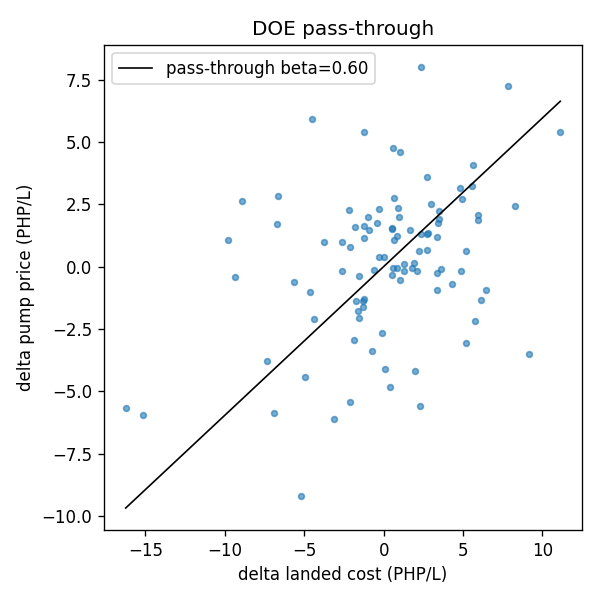
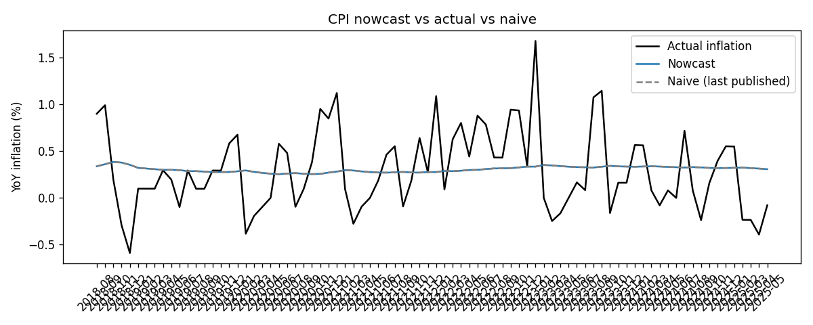
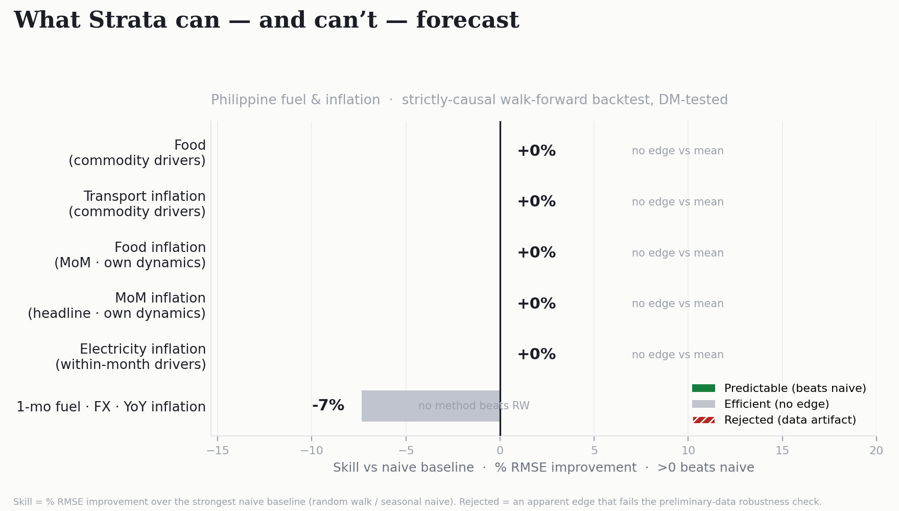
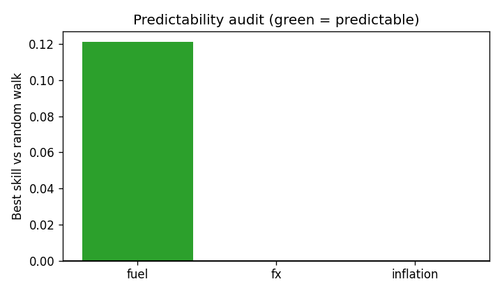

# Forecastable or Efficient? A Reproducible Predictability Audit and Nowcast of Philippine Fuel, FX, and Inflation

**Author:** Sindous
**Draft:** 2026-06-10 · grounded in the frozen `ph_economic_ai/benchmark/artifacts/accuracy_report.json` and companion tables.
**Status:** Draft. All empirical values are taken verbatim from committed artifacts; the §1.1 macro figures (2022–2025 episode) are drawn from PSA and BSP releases, cited under *Primary institutional and data sources* in the References (specific release reference numbers to be confirmed in the final version).

---

## Abstract

Claims that machine learning or multi-agent AI systems can "predict the economy" are common and rarely tested against a hard baseline. This thesis asks a narrower, answerable question for the Philippine case: can standard methods forecast monthly fuel prices, the peso–dollar exchange rate, and inflation better than naive persistence — and if a series resists forecasting, can the official figure at least be *nowcast* before its release? I build a small, fully reproducible benchmark that evaluates every claim with a strictly causal walk-forward backtest, an eight-method forecaster panel, Diebold–Mariano significance tests against the *strongest* simple baseline, and split-conformal prediction intervals. The result is a **predictability map**, and it is uniformly negative. One-month-ahead forecasts of premium gasoline (RON95), USD/PHP, and year-on-year inflation are **informationally efficient**: no method significantly beats a random walk — a null the accompanying power analysis bounds to a ~25% minimum detectable effect, so it rules out a large exploitable edge rather than every edge — reproducing Meese–Rogoff (FX) and Atkeson–Ohanian (inflation) for an emerging market. No nowcast target is predictable either, once the baseline pool is correctly specified.

That last qualification is the thesis's principal methodological contribution, and it arrived by self-refutation. An earlier version of this audit reported four significant positives, including a flagship within-month "driver edge" for electricity (Ridge +28.3%, DM p = 0.0011) that survived sub-sample stability tests, a preliminary-data robustness re-test, a Bonferroni family-wise correction, and carried an institutionally accurate mechanism. All were measured against a baseline pool of {random-walk, seasonal-naive, drift}, which omits the **historical mean**.

That the mean belongs in such a pool follows from existing work on baseline choice; what this thesis adds is the magnitude. For a covariance-stationary target with lag-1 autocorrelation ρ, a forecaster carrying no information beyond the unconditional mean shows an apparent skill over the random walk of **S(ρ) = 1 − [2(1 − ρ)]^(−1/2)**, positive exactly when ρ < ½ and ≈ +29% at ρ = 0. The expression matches simulation through the audit's own backtest to ≤ 0.011, and predicts the observed mean-versus-random-walk gap on all five real targets to ≤ 0.022. Inverted it becomes a diagnostic: the +28.3% electricity edge implies ρ ≈ 0.027, and electricity month-on-month inflation measures ρ = +0.002 — the flagship finding is fully accounted for by the target's own autocorrelation, with no driver, model, or mechanism required. With the mean in the pool every positive becomes a null (electricity Ridge is **1.8% worse than a constant**, p = 0.37; headline inflation falls from +16.2% to +4.1%, p = 0.36). A symmetry check confirms the correction cannot manufacture false negatives: on persistent level series ρ exceeds ½, the mean scores −1.7 to −2.1, and the forecasting nulls are untouched.

Because S(ρ) is a property of the target rather than of the estimation, the artifact neither decays out of sample nor varies across sub-samples, and is unaffected by multiple-comparison correction — so a stack of robustness checks that all condition on the baseline offers the reassurance of five checks and the coverage of one.

The contribution is therefore methodological as much as empirical: an honest, reproducible protocol that separates what is forecastable from what is efficient in a data-poor economy, and a demonstration that the choice of naive baseline — not the model, the significance test, the robustness check, or the multiple-comparison correction — silently determined the verdicts. Every guard in the audit passed; only the baseline was wrong. A companion contribution turns the map outward: it conditions a program-aided *anchoring* layer that lets a small, offline language-model system produce physically coherent estimates on commodity hardware — each series anchored to the signal its own backtest identified, and each anchor regressed against the same real data, so that the one anchor that predicts (fuel, correlation 0.60 against realized pump changes) is distinguished from the two that only guard magnitude (electricity, food) rather than presented as uniform successes.

---

## 1. Introduction

### 1.1 Motivation
Fuel and food prices, and the inflation they feed, dominate Philippine household budgets and monetary-policy debate — never more visibly than during the 2022–2025 period that motivates this study. The Russian invasion of Ukraine in February 2022 drove world crude and refined-product prices to multi-year highs, and because Philippine pump prices have been market-determined since the Downstream Oil Industry Deregulation Act of 1998 (Republic Act 8479) — adjusted on a near-weekly cycle that tracks Mean of Platts Singapore quotations — the shock passed quickly to the pump, lifting gasoline and diesel to record levels by mid-2022 and prompting targeted fuel subsidies for the transport sector (e.g. the *Pantawid Pasada* programme). Excise taxes on petroleum products, raised in tranches under the 2018 TRAIN Law (Republic Act 10963), kept retail prices structurally elevated; proposals to suspend them during the 2022 spike were debated but not enacted.

The pass-through to consumer prices was rapid. Headline CPI inflation climbed through 2022 (averaging 5.8% for the year) to **8.7% year-on-year in January 2023** — its highest since November 2008, a roughly fourteen-year peak — well above the Bangko Sentral ng Pilipinas (BSP) target band of 2–4%, with food and fuel-intensive components among the largest contributors. The BSP responded by raising its policy rate from **2.0% to 6.50%** in a sequence of hikes from May 2022 through October 2023 (a cumulative 400 basis points). Inflation then receded: the annual average eased from 6.0% in 2023 to **3.2% in 2024** (back inside the 2–4% target) and further to about **1.7% in 2025** — below the band, the lowest in nearly a decade. Throughout, the monthly inflation print released by the Philippine Statistics Authority (PSA) was a closely watched signal that moved expectations and framed each BSP decision.

In that environment, a credible ability to anticipate next month's fuel price or inflation rate — even by the short interval between the close of within-month data and the official PSA release — would be valuable to households, firms, and the central bank. This is the practical question the thesis makes precise and tests. *(Sourced from PSA and BSP releases — Jan-2023 peak 8.7% [PSA CPI, highest since Nov-2008]; annual averages 5.8/6.0/3.2/1.7% for 2022–2025 [BSP]; policy rate 2.0%→6.50% by Oct-2023 [BSP]; target band 2–4% — cited under Primary institutional and data sources in the References.)*

### 1.2 The gap
A wave of applications — including multi-agent "swarm" and large-language-model systems — claim to forecast prices or "the economy," but almost none report a like-for-like comparison against the simplest defensible benchmark: assuming next month looks like this month. Without that comparison, an impressive-looking forecast says nothing. The prior question is therefore not "how good is the model?" but "is this series forecastable at all, relative to naive persistence — and how would anyone know?"

### 1.3 Research questions
- **RQ1.** Can standard methods forecast one-month-ahead PH fuel, FX, and year-on-year inflation better than a random walk?
- **RQ2.** If forecasting fails, what mechanism explains the efficiency?
- **RQ3.** Can the official inflation figure be *nowcast* before its release, and is any edge an information-timing effect or a time-series-dynamics effect?
- **RQ4.** Is any positive result robust to a larger, more varied sample?

### 1.4 Contributions
1. A small, fully reproducible benchmark (`ph_economic_ai/benchmark/`) that turns "is it accurate?" from an assertion into a re-runnable measurement.
2. A **predictability map** of Philippine macro series: forecast and nowcast targets alike show no detectable edge over a properly-specified naive baseline.
3. A **quantified mirror to the "mind the naive forecast" warning** (§2.4a, §4.7). The literature warns that the naive benchmark is *too hard* to beat on random-walk-like series (Hewamalage et al., 2023; Beck et al., 2025). The complementary failure — that on mean-reverting rates it is *too easy* — is given an exact magnitude here: a forecaster carrying no information beyond the unconditional mean scores S(ρ) = 1 − [2(1 − ρ)]^(−1/2) against the random walk, positive exactly when the target's lag-1 autocorrelation ρ < ½, and ≈ +29% at ρ = 0. The derivation is elementary; the contribution is its use as a **diagnostic**. Inverted, it converts any reported skill-over-random-walk into the autocorrelation that would produce it for free, which a reader can compare against the target's measured ρ. Applied to this audit's own flagship finding — an electricity "driver edge" of +28.3% that cleared significance, sub-sample stability, a real-time-vintage re-test, a Bonferroni correction, and an institutionally accurate mechanism — it returns an implied ρ of 0.027 against a measured 0.002: fully explained without any driver. The expression matches simulation to ≤ 0.011 and the observed gap on all five real targets to ≤ 0.022.
4. A **case study in non-independent robustness**: the same episode shows that a stack of guards which all condition on the baseline provides the reassurance of five checks and the coverage of one. Because S(ρ) is a property of the target rather than of the estimation, the artifact is stable out of sample and across sub-samples *by construction* — so stability testing actively corroborates it.
5. A discipline of *honest bounding*: removing fabricated confidence, requiring a beat over the strongest baseline — including the mean — using ablation to attribute any win to a mechanism rather than overclaiming, and reporting the superseded map alongside the corrected one so the change is auditable rather than quietly absorbed.
6. A companion application contribution — **benchmark-conditioned anchoring** (§6.6): a program-aided method that makes a small, offline language-model system produce physically coherent estimates by anchoring each series to the signal its *own* backtest identified, with every anchor regressed against the same real data and honestly separated into a validated pass-through predictor (fuel) and magnitude guards that do not forecast (electricity, food).

### 1.5 Roadmap
Section 2 reviews efficiency, nowcasting, and forecast-evaluation literature. Section 3 documents data and the fuel-proxy validation. Section 4 details the methodology. Section 5 reports results. Section 6 discusses the efficient-vs-forecastable boundary, the role of honesty as method, and the application of the predictability map to an offline anchoring layer (§6.6). Section 7 concludes.

---

## 2. Background and Literature Review

This thesis sits at the intersection of four literatures: market efficiency and the random-walk benchmark, the predictability of inflation, nowcasting, and the statistics of forecast evaluation and uncertainty quantification. Each supplies a piece of the protocol used here, and each frames a specific way the empirical claims could be wrong. The review proceeds from the benchmark this thesis must beat, through the one setting where beating it is plausible, to the tools that decide whether a "beat" is real.

### 2.1 Market efficiency and the random-walk benchmark
The conceptual anchor is the efficient-market hypothesis (Fama, 1970): if prices already incorporate available information, future changes are unforecastable from that information, and the best predictor of tomorrow is today. In forecasting practice this becomes the random walk — a deceptively strong benchmark. The canonical demonstration is Meese and Rogoff (1983), who found that structurally-motivated exchange-rate models fail to beat a random walk out of sample at short horizons, despite using realized values of their own regressors. Four decades of re-examination have left the result largely intact: Cheung, Chinn and Pascual (2005) reconfirmed it across model classes and currencies, and the survey by Rossi (2013) concludes that exchange-rate predictability, where it exists, is fragile and horizon- and period-dependent. The lesson is not that markets are literally efficient but that the random walk is an *empirically* high bar; beating it requires genuine, stable, exploitable structure rather than in-sample fit. Accordingly, this thesis treats the random walk and its near-relatives — drift and seasonal-naive — as the family of baselines every candidate method must clear, and reports the *strongest* of them as the bar (Section 4.7).

### 2.2 Inflation forecasting and the naive benchmark
A parallel result holds for inflation. Atkeson and Ohanian (2001) showed that elaborate Phillips-curve forecasts struggle to beat a naive forecast that simply projects recent inflation forward, prompting a large literature on *why* inflation became "hard to forecast" (Stock and Watson, 2007) and on the conditions under which any model adds value (the survey of Faust and Wright, 2013). The common thread is persistence: a highly autocorrelated series leaves little for a model to add beyond its own lag. This thesis takes that thread literally and turns it into a testable mechanism. Year-on-year inflation is an overlapping twelve-month difference, so consecutive observations share eleven months of information and the naive forecast is mechanically excellent; the month-on-month transform removes that overlap and exposes whatever short-run dynamics remain. The framing in which a series is measured, not the series itself, can therefore determine whether it appears forecastable — a point the empirical results (Section 5.3) make concrete.

### 2.3 Nowcasting
Forecasting and *nowcasting* are distinct problems often conflated in applied "AI predicts the economy" work. Nowcasting (Giannone, Reichlin and Small, 2008; Bańbura, Giannone, Modugno and Reichlin, 2013) estimates a target *before its official release* by exploiting information that is already observable within, or shortly after, the reference period — the "real-time data flow." Related contributions include Evans (2005) on real-time GDP and the mixed-frequency activity index of Aruoba, Diebold and Scotti (2009); the review by Bok et al. (2018) synthesizes the field. The crucial conceptual point is that a nowcast edge is one of *information timing*, not of beating an efficient market: for a given calendar month, world oil, the exchange rate, and retail fuel are observable before the Philippine Statistics Authority publishes that month's CPI. A nowcast that beats persistence is therefore not a violation of efficiency but an exploitation of publication lag — a weaker, and far more defensible, claim. This distinction is the hinge of the thesis (RQ3): it is precisely where, if anywhere, a genuine positive result should be found, and it disciplines the interpretation of the one that is.

### 2.4 Evaluating and comparing forecasts
A lower error in one sample can be noise. Diebold and Mariano (1995) formalized the comparison with a test of equal predictive accuracy based on the loss-differential series; Harvey, Leybourne and Newbold (1997) supplied the small-sample correction used throughout this thesis, and West (1996) developed the asymptotics for predictive inference. A known subtlety is that the standard Diebold–Mariano test is designed for *non-nested* models; when one model nests the benchmark — as a model that can collapse to a random walk does — the test is conservative, and Clark and West (2007) propose an adjusted statistic. The retrospective by Diebold (2015) clarifies the test's intended scope. This thesis compares distinct method classes (e.g. ARIMA versus random walk) and applies the HLN-corrected Diebold–Mariano test as the arbiter of every "beats"/"efficient" verdict, treating raw RMSE ordering as suggestive only; the conservativeness under near-nesting biases *against* false positives, which suits an audit whose priority is not to overclaim.

### 2.4a Which naive benchmark? Two opposite failure modes

The significance test presupposes a benchmark, and the choice is not innocuous. Two literatures warn about it from opposite directions, and this thesis sits in the gap between them.

The first warns that the naive forecast is **too hard** to beat, and that apparent wins over it are spurious. Hyndman and Koehler (2006) motivate scale-free measures built on a naive benchmark; Hewamalage, Ackermann and Bergmeir (2023) catalogue the resulting evaluation pitfalls, noting that on a series which is genuinely a random walk the naive forecast is optimal by construction, so a model that appears to beat it has produced a spurious result. Beck, Dovern and Vogl (2025) make the empirical case at scale: across exchange rates, NASDAQ100 constituents, and FRED-MD, machine-learning models fail to beat a no-change forecast, and the closer a series is to a random walk the less useful complex models become. Their conclusion — include the naive benchmark, or your comparison is uninformative — is the discipline this audit adopts.

The second, less commonly stated in applied work, is the **mirror failure**: on a series that is *not* close to a random walk, the naive forecast is a weak benchmark, and beating it is uninformative in the other direction. The forecasting literature records the ingredients — the unconditional mean is the optimal forecast for white noise, the naive forecast is optimal for a random walk, and the mean becomes competitive as autocorrelation falls — and West and Lunsford (2026) study the closely related question of what happens when a random-walk model is used to forecast a *stationary* process, finding it has unusually low bias. What is not standard is a statement of how large the resulting distortion is, or a rule for when it applies. Section 4.7 supplies both: a forecaster carrying no information beyond the unconditional mean out-scores the random walk by exactly S(ρ) = 1 − [2(1 − ρ)]^(−1/2), positive if and only if the lag-1 autocorrelation ρ < ½.

The two failure modes are complementary and are distinguished by the target's persistence. Beck et al. study *levels* (exchange rates, equity prices) which are close to random walks, where naive is hard to beat. Every nowcast target in this thesis is a *month-on-month rate* with ρ well below ½, where naive is too easy to beat. An audit that adopts only the first warning — as the earlier draft of this one did — is fully protected against one error and entirely exposed to the other.

### 2.5 Distribution-free uncertainty
Honest forecasts require honest intervals. Conformal prediction (Vovk, Gammerman and Shafer, 2005; Shafer and Vovk, 2008) constructs prediction sets with finite-sample coverage guarantees under the sole assumption of exchangeability, without distributional or model-correctness assumptions; the split-conformal variant (Lei et al., 2018) makes this computationally trivial for a fitted regressor, and the tutorial of Angelopoulos and Bates (2023) gives the modern treatment. This machinery replaces the ad hoc — or, in the application this thesis grew out of, *fabricated* — "confidence" numbers common in deployed tools with intervals whose empirical coverage is measured and reported alongside the nominal level (Section 5.1). Where exchangeability is strained by time-series dependence, the reported coverage is treated as approximate and disclosed as such, rather than asserted.

### 2.6 Forecast accuracy measures and combination
Comparing errors across series of different scales motivates scale-free measures; this thesis uses the Mean Absolute Scaled Error (Hyndman and Koehler, 2006) alongside RMSE, MAE, MAPE and an explicit skill score, skill = 1 − RMSE_model / RMSE_baseline. Because the evaluation runs a panel of methods rather than a single model, the forecast-combination literature is also relevant: Bates and Granger (1969) established that combinations often dominate their constituents, and the survey of Timmermann (2006) catalogues when and why. Here the panel is used diagnostically — to locate the best honest competitor to the baseline — rather than to manufacture a winner by combination, but the literature motivates reporting the full panel rather than a single hand-picked model.

### 2.7 Philippine context
Two institutional facts make the Philippine case tractable. First, under the Downstream Oil Industry Deregulation Act (Republic Act 8479, 1998), domestic fuel pricing is deregulated and oil companies adjust pump prices on a near-weekly cycle that tracks world product prices (Mean of Platts Singapore, and Brent as a proxy) with a short lag. The pass-through literature — "rockets and feathers" (Bacon, 1991; Borenstein, Cameron and Gilbert, 1997) — documents that such retail prices follow upstream costs partially and asymmetrically, which is exactly the partial, lagged pass-through estimated in Section 5.2 and the mechanism behind the efficiency of the fuel series. Second, the Philippine Statistics Authority releases the Consumer Price Index on a fixed monthly calendar and publishes commodity-group detail (including Transport) through OpenSTAT, with recent vintages marked preliminary and subsequently revised — a feature that proves decisive for the Transport-CPI robustness result (Section 5.5). The gap this thesis fills is the absence, for Philippine macro series, of a reproducible and honestly-bounded predictability audit: most fuel- or inflation-"prediction" work in this space, including recent multi-agent and large-language-model systems, reports no like-for-like comparison against the naive benchmark and no out-of-sample significance test, and is therefore not assessable as a forecasting claim at all.

---

## 3. Data

All series are committed as CSVs and regenerable via `benchmark/refresh_data.py`; the benchmark reads only frozen files, so every number is reproducible offline.

### 3.1 Fuel (ground truth)
Premium gasoline (RON95), monthly PHP/litre, from the World Bank **Global Fuel Prices Database** (Open Database License). The committed gold series underpins the one-month forecast backtest over **2019-11 to 2025-03 (n = 79 months)**.

### 3.2 Exchange rate
USD/PHP monthly from Yahoo Finance (`PHP=X`).

### 3.3 Inflation
Philippine CPI from the IMF **International Financial Statistics** via DBnomics, transformed to year-on-year (YoY) and month-on-month (MoM) inflation.

### 3.4 Predictors
Brent crude (`BZ=F`), USD/PHP (`PHP=X`), an RBOB-gasoline→PHP landed-cost proxy (`RB=F`), and a seasonal demand index. Two feature panels are built: a standard ~10-year window and a **long window (Yahoo `max`, 2007–2026, 177 months)** used for the robustness re-test.

### 3.5 Fuel-proxy validation
Because high-frequency retail RON95 is not freely available as a long gold series, an RBOB-derived proxy is validated against the World Bank gold: Pearson **r = 0.91** with a mean bias of **−₱5.88/L** (disclosed, not corrected away). The proxy is fit for *directional/relative* validation, a stated limitation.

### 3.6 Reproducibility
`python -m ph_economic_ai.benchmark.run` regenerates every artifact (report, ablation, efficiency panel, pass-through, audit, YoY and MoM nowcasts, driver ablation, longer-sample confirmation, and figures) from the committed CSVs.

---

## 4. Methodology

### 4.1 Causal walk-forward backtest
The validity foundation. At each step t, models train only on data through t and predict t+1 (expanding window, minimum train = 24 months). A leakage-guard test asserts no future information enters any feature. This is what makes the accuracy claim defensible rather than in-sample.

### 4.2 Forecaster panel
Eight methods: random-walk, drift, seasonal-naive, the **historical mean**, ARIMA(1,1,1), ETS (additive trend), Ridge regression, and HistGradientBoosting. The first four are baselines; the last four are candidates. The historical mean is the expanding-window unconditional mean of the training window (no leakage): it is the optimal constant predictor, and for a mean-reverting series it — not the random walk — is the baseline to beat (§4.7).

### 4.3 Metrics
MAE, RMSE, MAPE, MASE, and skill = 1 − RMSE_model/RMSE_baseline.

### 4.4 Significance
Diebold–Mariano with the Harvey–Leybourne–Newbold small-sample correction. A method "beats" a baseline only if it has lower RMSE *and* DM p < 0.05; otherwise the verdict is "efficient"/"no better than naive."

### 4.5 Calibrated uncertainty
Split-conformal intervals at nominal 50/80/90/95%, with an empirical-coverage calibration table reported alongside the nominal levels.

### 4.6 Forecasting vs nowcasting
Forecasting uses only information available *before* the reference month (lagged features + previous value). Nowcasting adds *within-month observable* drivers (contemporaneous oil/FX/fuel) plus the previous print — modelling the real situation in which those inputs are known before the PSA release. An eligibility rule keeps only genuinely pre-release information.

### 4.7 Baseline discipline (the hollow-win guard)
A candidate must beat the *strongest* of {random-walk, seasonal-naive, drift, **historical mean**}, not the weakest. This prevents a "win" that merely clears a baseline no one would use; it is enforced in code and unit-tested.

**Why the mean belongs in the pool.** The choice of baseline pool is not cosmetic; on a mean-reverting target it decides the verdict. A random walk predicts *last month's value*, so on a series that reverts it is systematically wrong by roughly √2 times the series' standard deviation, while the constant mean is wrong by one standard deviation. Every month-on-month inflation target in this audit is such a rate. A pool of {random-walk, seasonal-naive, drift} therefore sets the bar at a predictor that is *structurally weak for this class of target*, and any model that merely reverts to the mean clears it — scoring as "skill" what is actually the absence of a random walk.

That the mean belongs in a naive pool is not a new observation. It is implicit in the scale-free measures of Hyndman and Koehler (2006); the Atkeson–Ohanian (2001) result is precisely an argument about which baseline an inflation forecast must clear; and the textbook comparison — the mean is optimal for white noise, the naive forecast for a random walk, and the mean grows more competitive as autocorrelation falls — is standard (§2.4a). The derivation below is elementary, resting on two variance calculations, and may well be folklore among forecasters even where it is not written down. What is nevertheless absent from applied practice, and what this section supplies, is a statement of **how large the distortion is, exactly when it applies, and how to test a published result for it**.

**A closed form for the artifact.** Let the target be covariance-stationary with variance σ² and lag-1 autocorrelation ρ. The random-walk forecast error is yₜ − yₜ₋₁, with variance 2σ²(1 − ρ); the mean forecast error is yₜ − μ, with variance σ². A forecaster carrying **no information beyond the unconditional mean** therefore exhibits an apparent skill over the random walk of

**S(ρ) = 1 − [2(1 − ρ)]^(−1/2),  which is positive if and only if ρ < ½.**

The crossover at ρ = ½ is exact, and only ρ enters — so the result holds for any stationary target, not merely an assumed AR(1). At ρ = 0 it gives S = 1 − 1/√2 ≈ **+29.3%**: on a white-noise rate, a model that has learned nothing at all is credited with a ~29% improvement over the random walk.

**Validation.** `benchmark/baseline_theory.py` checks the expression two ways. Against the project's own walk-forward estimator on simulated AR(1) targets — which uses an expanding-window mean, not the true μ — predicted and simulated skill agree to ≤ 0.011 across ρ ∈ [−0.2, 0.8]. Against the five real MoM targets:

| Target | ρ (lag-1) | S(ρ) predicted | mean-vs-RW observed | abs. error |
|---|---|---|---|---|
| Headline MoM | +0.343 | +12.8% | +12.6% | 0.002 |
| Headline MoM (long) | +0.369 | +11.0% | +12.2% | 0.012 |
| Food MoM | +0.375 | +10.6% | +12.8% | 0.022 |
| **Electricity MoM** | **+0.002** | **+29.2%** | **+29.6%** | 0.004 |
| Transport MoM | +0.140 | +23.8% | +24.8% | 0.010 |

The closed form accounts for the observed gap on every target to within 0.022. Inverting it is diagnostic: the audit's flagship electricity "driver edge" of **+28.3%** implies ρ ≈ 0.027, and electricity MoM in fact measures ρ = +0.002. The headline result of the earlier draft is therefore quantitatively explained by the target's own autocorrelation, with no reference to any driver, model, or mechanism. A referee can apply the same inversion to any reported edge: if the implied ρ matches the target's measured ρ, the edge is consistent with pure baseline weakness.

**Why every robustness check passed.** S(ρ) is a property of the *target*, not of the estimation. It requires no data mining, no leakage, and no overfitting — so it does not decay out of sample, does not vary across sub-samples, is untouched by a real-time-vintage re-test, and is unaffected by multiple-comparison correction. Any guard that does not interrogate the baseline will pass it, which is exactly what §5.7 records.

**The bar is not vacuous.** A controlled test (`test_mean_baseline_rejects_the_beat_the_random_walk_artifact`) constructs a target as `0.6 × Δfuel + noise` while offering only the fuel *level* as a feature, so the driver is unrecoverable by construction. Ridge is then measurably **worse than the constant** (RMSE 0.643 vs 0.623) yet beats the random walk (0.871) by 26% — scoring as `beats_best_naive` under a mean-free pool. The companion test supplies the true driver, and Ridge wins decisively (91% skill over the mean, DM p < 0.001). The stricter bar rejects the artifact without suppressing genuine signal.

Adding the mean cannot manufacture a false *negative* either: on the persistent level series (fuel, FX, YoY inflation) ρ sits far above ½, the mean scores −1.7 to −2.1 in skill, and it never becomes the binding baseline — so the §5.1 efficiency verdicts are untouched. The correction bites exactly where S(ρ) predicts and nowhere else. Consequences for the nowcast verdicts are in §5.3–§5.8; the derivation is documented in `docs/defense/mean-baseline-finding.md`, with the superseded (mean-free) map retained in `corrected_predictability_map.json`.

### 4.8 Ablation and robustness
A **driver-only ablation** drops the own-lag (previous MoM) and restricts candidates to the driver regressors, isolating any within-month information edge from time-series dynamics. A **longer-sample re-run** rebuilds features on the 2007–2026 window and repeats the MoM nowcast and ablation.

### 4.9 Multiple comparisons
Where an audit conducts several confirmatory Diebold–Mariano tests — each of the form "beats the strongest naive baseline" — testing them at α = 0.05 individually inflates the family-wise false-positive rate. The confirmatory family is defined *dynamically* as the tests returning a `beats_best_naive` verdict with a computable p-value; the efficiency findings are excluded, since accepting a null raises a power question (quantified in §5.1), not a false-positive one. Two corrections are applied and reported (`multiple_testing.json`, regenerated by `benchmark.multiple_testing`): the **Bonferroni** procedure controlling the family-wise error rate (the strictest), and the **Benjamini–Hochberg** step-up controlling the false-discovery rate.

Under the corrected baseline pool (§4.7) this family is **empty**, and the machinery reports `n_tests = 0`. The procedure is retained, and unit-tested against synthetic families, for two reasons: a future genuine positive must still be corrected, and the earlier draft's experience is itself instructive. That draft ran six confirmatory tests and reported that four survived Bonferroni — arithmetically correct, and completely uninformative about the actual error, because a family-wise correction guards against testing *many* hypotheses and offers no protection when every hypothesis is measured against an unsuitable baseline. Multiple-comparison control is not a substitute for baseline specification (§5.8).

### 4.10 Integrity infrastructure
The fabricated "90% confidence" from the original application was removed and replaced with the conformal interval. A frozen `accuracy_report.json` plus a hash-chained, two-phase track record make results tamper-evident and quotable.

---

## 5. Results

### 5.1 One-month forecasting is efficient (RQ1)

**Fuel.** On the efficiency panel (n = 52 forecasts, drawn from the 79-month feature-aligned window of §3.1), the best ML model (HistGradientBoosting) has RMSE 4.099 vs the random walk's 4.069 — a skill of **−0.0075**: no improvement. Against the seasonal-naive baseline the model's skill is +0.64, i.e. the gain is over a *bad* baseline, not the strong one.

On the efficiency panel (n = 52), no method significantly beats the random walk:

| Method | RMSE | Skill vs RW | DM p vs RW |
|---|---|---|---|
| random_walk | 4.069 | 0.000 | — |
| drift | 4.110 | −0.010 | 0.504 |
| ETS | 4.183 | −0.028 | 0.275 |
| Ridge | 4.105 | −0.009 | 0.881 |
| **HGB** | **4.099** | **−0.008** | **0.921** |
| ARIMA | 4.383 | −0.077 | 0.037 (worse) |
| seasonal_naive | 11.497 | −1.826 | 0.0001 (worse) |

The ML methods are statistically *indistinguishable* from the random walk (DM p ≈ 0.88–0.92); ARIMA and seasonal-naive are significantly worse. No method beats the random walk at the one-month horizon.

**Power — what "efficient" can and cannot mean here.** Accepting the null on a modest sample is only informative if the test could have rejected it, so the efficiency verdict is bounded by a power analysis (`power.json`). For the fuel forecast, the minimum skill the Diebold–Mariano test could detect at 80% power (α = 0.05) is **≈ 25%** RMSE improvement over the random walk; the observed skill is −0.3%. The honest reading is therefore **"no economically-large edge (≳ 25%) is detectable at this sample size,"** not "predictability is proven absent" — the test rules out a large, exploitable edge but cannot exclude a small one. This is the same bound Meese–Rogoff-style results carry and rarely state; here it is quantified.

**The predictability audit** extends this verdict across targets:

| Target | n | Verdict |
|---|---|---|
| Fuel (RON95) | 52 | no detectable edge over RW (efficient to a ~25% MDE) |
| USD/PHP | 38 | no detectable edge over RW |
| Inflation (YoY) | 59 | no detectable edge over RW |

All three show no detectable edge — reproducing Meese–Rogoff (FX) and Atkeson–Ohanian (inflation) for the Philippines, subject to the power bound above (which is tightest for the smallest samples, USD/PHP at n = 38).

**Calibration (fuel forecast).** The conformal intervals (half-widths ₱2.56/5.88/10.42/11.86 at 50/80/90/95%) over-cover at the upper levels (measured coverage 0.58, 0.88, 1.00, 1.00 over the disjoint 26-month validation half of the 52-forecast backtest) — i.e. conservative, honestly reported rather than tuned.

### 5.2 Mechanism (RQ2)
A pass-through regression of the RON95 change on contemporaneous and lagged driver changes (n = 77) gives β₀ = 0.31, β₁ = 0.24, **total pass-through β = 0.56**, R² = 0.33, with a near-zero driver autocorrelation (ACF₁ = 0.16). Interpretation: domestic fuel reflects a *partial, lagged* pass-through of a driver (world product price) that is itself close to a random walk. A predictable level built on an unpredictable, near-random-walk driver is exactly what produces an efficient series — the mechanism behind RQ1.

The Phase-2 gated feature ablation selected the `passthrough_lags` variant as the best-justified specification; it still did not beat the random walk, but it closed the model-vs-RW gap and tightened intervals.

**Figure 1.** Estimated pass-through of contemporaneous and lagged driver changes to the monthly RON95 change (total β = 0.56, R² = 0.33). A partial, lagged pass-through of a driver that is itself close to a random walk is the mechanism behind the fuel series' efficiency.

### 5.3 Nowcasting (RQ3)

**YoY nowcast.** Adding within-month oil/FX/fuel plus the previous print, before the PSA release, still yields **no_better_than_naive** (n = 61). Year-on-year inflation overlaps 11 of 12 months with its prior value, so persistence is mechanically near-unbeatable.

**MoM nowcast — a null once the baseline is right.** Targeting month-on-month inflation, the honest bar is to beat the strongest of {random-walk, seasonal-naive, drift, mean} by a DM test (§4.7). The result is **no_better_than_naive**, and the binding baseline is the **historical mean**:

| Method | RMSE (n = 61) |
|---|---|
| ARIMA | 0.380 |
| **mean (best naive)** | **0.396** |
| Ridge | 0.398 |
| ETS | 0.4135 |
| random_walk | 0.453 |
| HGB | 0.457 |
| drift | 0.458 |
| seasonal_naive | 0.534 |

The decisive comparison is which baseline the candidate is measured against:

| Comparison | Skill | DM p |
|---|---|---|
| ARIMA vs random-walk | +16.2% | 0.032 |
| **ARIMA vs mean** | **+4.1%** | **0.358** |
| Ridge vs mean | −0.5% | 0.947 |

Almost the whole of the apparent +16.2% is the gap between the *random walk and the mean*, not between the model and a serious baseline: on a mean-reverting rate the random walk is wrong by roughly √2 standard deviations while a constant is wrong by one. Against the mean, ARIMA retains a residual +4.1% that is nowhere near significance (p = 0.36), and Ridge is *worse than the constant*. The honest verdict is therefore that **month-on-month inflation is not nowcastable beyond a naive baseline** at this sample size. The earlier positive was an artifact of a baseline pool that omitted the mean.

**Figure 2.** Month-on-month inflation nowcast (n = 61): ARIMA (own-dynamics) against the realized pre-release actual. ARIMA's apparent +16.2% edge is measured against the random walk; against the historical mean — the appropriate naive for a mean-reverting rate — the edge falls to +4.1% and is not significant (p = 0.36).

**Driver-only ablation.** Dropping the own-lag and restricting to driver regressors likewise gives **driver_edge = False** (n = 61). This verdict is unchanged by the correction: the contemporaneous-driver edge was never significant.

### 5.4 Robustness (RQ4)
Rebuilding features on the 2007–2026 window (n = 143, spanning the GFC, the 2014 oil crash, and COVID) and re-running:

| Metric | n = 61 | n = 143 |
|---|---|---|
| MoM verdict | no_better_than_naive | no_better_than_naive |
| best naive | mean | mean |
| skill vs best naive | 0.0 | 0.0 |
| driver_edge | False | False |

The null **holds across ~2.3× the data** and a far more heterogeneous regime mix. This is the mirror image of the earlier reading: what previously "held and strengthened" (p tightening from 0.032 to 0.001 against the random walk) was the *stability of the baseline artifact*, not of a forecasting edge. A larger, more varied sample estimates the historical mean more precisely, so a mean-reverting target becomes harder to beat, not easier — the correct robustness intuition, and the opposite of what the mean-free pool implied.

### 5.5 A spurious positive caught: the Transport-CPI nowcast

If any series should yield a significant within-month *driver* edge, it is **Transport** CPI — mechanically driven by fuel, which is observable before the official release. Using the official PSA Transport-CPI series (OpenSTAT, by commodity group, 2018 = 100, 1994–present) as a fresh gold target and the same free fuel/FX predictors, the nowcast was re-run (n = 151 backtest months).

On the **full sample**, the driver-only model looked like the sought-after positive: fuel-only Ridge beat the best naive baseline by **+14.8%** (DM p = 0.021). Taken at face value, this would license the headline "the fuel-driven component of inflation is nowcastable ahead of the official figure."

A robustness re-test dissolved it. PSA's three most recent prints are **preliminary** and anomalous — Transport CPI 130 → 142 → 156 → 148 for early 2026 (i.e. +9.5%, +10.0%, −5.0% MoM), values the agency revises in later vintages. Dropping the trailing six preliminary months collapses the skill from +14.8% to **zero**:

| Test | Verdict | skill vs best naive | DM p |
|---|---|---|---|
| Driver-only, full sample (n = 151) | beats_best_naive | +14.8% | 0.021 |
| Driver-only, robust (drop 6 preliminary months, n = 145) | no_better_than_naive | 0.0 | — |

The entire "edge" rested on roughly three unreliable observations. The **canonical verdict is therefore that Transport MoM inflation is also efficient** — no robust within-month fuel edge — consistent with the rest of the map. More importantly, this is a worked example of the audit doing its job: it caught a positive that a naive analysis would have published, traced it to preliminary real-time data, and reported the robust null. The robustness re-test (`driver_edge_robust`) is baked into the pipeline, so the check is permanent and reproducible.

Under the corrected baseline pool the transport case is now **doubly rejected**: it fails the preliminary-data robustness check *and* fails against the historical mean. Two independent guards catch the same false positive — but only the second would have caught it had the data been clean, which is the point of §4.7.

### 5.6 Food inflation: a second own-dynamics positive and a clean null driver

The same protocol was applied to **Food & non-alcoholic beverages** — the largest contributor to Philippine headline inflation — with a food-appropriate predictor panel: free global agri-commodity futures (rice, wheat, corn, soybean) plus oil and FX, all observable within the month. The PSA Food-CPI gold (OpenSTAT, COICOP division 01, 2018 = 100) provides the target; n = 151 backtest months (2007–2026).

Two results emerge, and both are nulls under the corrected pool:

| Test | Verdict | best naive | skill vs best naive | DM p |
|---|---|---|---|---|
| Full nowcast (drivers + own-lag) | no_better_than_naive | mean | 0.0 | — |
| Driver-only ablation, full sample (n = 151) | no_better_than_naive | mean | 0.0 | — |
| Driver-only ablation, robust (drop 6 preliminary months, n = 145) | no_better_than_naive | mean | 0.0 | — |

First, the apparent own-dynamics positive **does not survive the mean**. ARIMA's RMSE is 0.663 against the mean's 0.689 — a residual **+3.7%**, DM p = 0.456. Measured against the random walk (0.790) the same model shows +16.0% at p = 0.0046, which is the number the earlier draft reported. As with headline inflation (§5.3), essentially the whole apparent edge is the random-walk-to-mean gap.

Second, the food-commodity **driver edge remains a clean null**, and is now null by a wider margin: driver-only Ridge (0.702) is *worse* than the constant (0.689), a skill of **−1.9%** (p = 0.72). The verdict is stable at both n = 151 and n = 145 (`driver_edge_robust = False`). Global commodity prices carry no within-month signal for Philippine food inflation, consistent with its strongly-local composition (fish, vegetables, import-controlled rice). This conclusion is unchanged by the correction — it was a null before and is a null now, which is exactly the kind of result that should be insensitive to the baseline pool.

### 5.7 Electricity: the flagship edge does not survive the mean

Electricity was the audit's strongest apparent positive, and it is the one the correction overturns most sharply. Using the PSA `04.5.1 - Electricity` gold and free energy predictors (Brent, natural gas, FX), the driver-only nowcast (n = 151) gave the headline result of the earlier draft: Ridge **+28.3% over the best naive, DM p = 0.0011**, stable across sub-samples (≤2023-12 +26%, p = 0.006; 2007–2016 +30%, p = 0.020; 2016–2026 +29%, p = 0.035) and surviving the trailing-preliminary robustness check. Every check the audit had *was* passed.

The baseline pool was the check it lacked. The RMSEs make the situation unambiguous:

| Method | RMSE (driver-only, n = 151) |
|---|---|
| **mean** | **2.3515** |
| Ridge | 2.3936 |
| ARIMA | 2.4925 |
| random_walk | 3.3399 |

| Comparison | Skill | DM p |
|---|---|---|
| Ridge vs random-walk | +28.3% | 0.0011 |
| **Ridge vs mean** | **−1.8%** | **0.371** |

Ridge is **worse than predicting the historical mean**. The entire +28.3% is the distance between the random walk and a constant — the signature of a mean-reverting target measured against a baseline unsuited to it, and precisely the failure mode reproduced under controlled conditions in §4.7. The corrected verdict is **no_better_than_naive**, with `driver_edge_robust = False`.

The mechanism story must be withdrawn with the result. The Meralco generation charge *is* a formulaic pass-through of observable fuel costs, and that remains true as institutional description; what the data do not support is the claim that this makes the monthly CPI print **nowcastable beyond a naive baseline**. A plausible mechanism was doing the work of evidence — a caution worth stating plainly, because the mechanism's plausibility is exactly what made the result feel safe. Sub-sample stability did not help either: an artifact rooted in the target's statistical character is stable by construction, so stability corroborated the wrong thing.

This is the single largest change the correction produces, and it removes the thesis's only claimed positive driven by contemporaneous observables.

### 5.8 The predictability map (synthesis)

| Target | Setup | Verdict |
|---|---|---|
| Fuel / FX / YoY inflation | 1-month forecast | efficient (no method beats RW) |
| YoY inflation | nowcast (pre-release) | no better than naive |
| MoM inflation (headline) | nowcast (pre-release) | no better than naive (ARIMA +4.1% vs mean, p = 0.36) |
| MoM inflation (headline, n = 143) | nowcast, long sample | no better than naive |
| MoM inflation (food) | nowcast (pre-release) | no better than naive (ARIMA +3.7% vs mean, p = 0.46) |
| Food-CPI MoM | nowcast, driver-only | clean null — Ridge −1.9% vs mean |
| Transport-CPI MoM | nowcast, driver-only | rejected twice — preliminary-data artifact *and* fails vs mean |
| Electricity-CPI MoM | nowcast, driver-only | no better than naive — Ridge **−1.8% vs mean** (p = 0.37) |

Every target in the audit now returns the same verdict: **no detectable edge over a properly-chosen naive baseline.** The map is uniform.

This is a weaker set of claims than the earlier draft made, and a stronger thesis. A predictability audit whose answer is "efficient almost everywhere" reproduces Meese–Rogoff and Atkeson–Ohanian for a new market and adds a methodological result of its own: that the *choice of naive baseline* silently determines the verdict, and that the omission of the historical mean is sufficient to manufacture four significant positives — one of which (electricity, p = 0.001) survived sub-sample stability checks, a robustness re-test, and a Bonferroni correction. Every guard in the audit passed. Only the baseline was wrong.

**Figure 3.** The predictability map — skill over the strongest naive baseline per target, with the historical mean in the pool. Every bar sits at or below zero: no target is predictable beyond naive. (Compare the superseded mean-free map in `corrected_predictability_map.json`, where four of these bars appear significantly positive.)

**Figure 4.** Audit verdicts by target. The same protocol that previously produced a three-way split (positive / null / rejected) returns a uniform null once the baseline pool is corrected.

**Multiple-comparison correction (§4.9).** The confirmatory family is defined as the tests returning `beats_best_naive` with a computable p-value. Under the corrected pool that family is **empty**: there are no positives left to correct, and `multiple_testing.json` records `n_tests = 0`. This is worth stating explicitly rather than silently dropping the section, because it inverts the earlier finding. The previous draft reported that four of six confirmatory tests survived the strict Bonferroni threshold — and that was arithmetically correct. A family-wise correction controls for testing *many hypotheses*; it offers no protection whatever against every hypothesis being measured against the wrong baseline. The correction machinery is retained and unit-tested against synthetic families so that a future genuine positive would still be classified correctly.

### 5.9 Search interest does not nowcast inflation

A recurring claim in applied work is that public attention — social posts, search volume — carries early signal about prices. Because the companion application (§6.6) reasons over exactly this kind of chatter, the claim is tested here with the same machinery rather than assumed.

Monthly Google Trends search interest for four price-salient terms (`presyo ng gas`, `diesel price`, `Meralco bill`, `bigas presyo`, PH geography, 2016–2026) is joined to the headline and food MoM nowcast frames and run through the identical walk-forward + Diebold–Mariano `mom_verdict` against the mean-inclusive pool. Three specifications are tested per target: search terms alone, drivers alone, and drivers plus search terms.

| Target | sentiment only | drivers only | drivers + sentiment |
|---|---|---|---|
| Headline MoM (n = 61) | no better than naive | no better than naive | no better than naive |
| Food MoM (n = 75) | no better than naive | no better than naive | no better than naive |

**Search interest does not nowcast Philippine fuel or food inflation beyond a naive baseline**, alone or as an increment to the drivers (`sentiment_nowcast.json`).

One measurement note matters for interpreting this null, because it nearly produced a vacuous one. Google Trends normalises every term within a *single query* against one shared 0–100 scale fixed by the highest observed point. Querying the four terms together let the highest-volume English term set the scale and collapsed the low-volume Tagalog terms to a near-constant zero — `presyo ng gas` was nonzero in 1 month of 127. A regression on a constant cannot fail to be uninformative, so that null would have carried no evidential weight. Re-querying each term in its own payload restores within-term variation (`presyo ng gas`: 22 nonzero months, 16 distinct values; `bigas presyo`: 94 and 27), at the cost of cross-term level comparability, which no part of this analysis uses. The reported null is therefore a null about *search interest*, not an artifact of a degenerate feature.

---

## 6. Discussion

### 6.1 The efficient-vs-forecastable boundary
The boundary this audit set out to draw turns out to lie in an unexpected place: not between series, but between *baselines*. The MoM transform does expose short-run autoregressive structure that the YoY frame hides — ARIMA's RMSE genuinely improves on the random walk's at every MoM target. What the corrected pool shows is that this structure is almost entirely **mean reversion**, and mean reversion is what a constant already captures. Removing the twelve-month overlap does not reveal exploitable signal; it reveals that the random walk was never the right yardstick for the transformed series. The honest boundary is therefore: efficient at one month, and efficient in the nowcast too — with the caveat that "efficient" here means "no edge detectable at these sample sizes" (§5.1's ~25% MDE), not "no edge exists."

### 6.2 Reproducing landmark results for an emerging market
Finding FX and inflation efficient at one month reproduces Meese–Rogoff and Atkeson–Ohanian outside their original developed-economy settings, adding external validity rather than novelty for its own sake.

### 6.3 Honesty as method
Several design choices each prevented a specific overclaim: removing the fabricated 90% confidence (replaced by measured conformal coverage); requiring a beat over the *strongest* baseline (the hollow-win guard); the driver-only ablation (which stopped "MoM is predictable" from silently becoming "the drivers predict inflation"); the real-time-data robustness re-test; and the multiple-comparison correction.

The Transport-CPI nowcast (§5.5) illustrates the discipline working as designed. A full-sample run produced an apparently significant fuel edge (+14.8%, p = 0.021) — precisely the bold "AI nowcasts fuel-driven inflation" headline one might want to claim. A real-time-data robustness check showed it rested on three preliminary, not-yet-revised PSA observations and vanished once they were removed. A method that only ever confirms is not doing robustness.

The Electricity-CPI result (§5.7) illustrates the harder lesson, and is the more valuable of the two. Its +28.3% driver edge passed *every* guard listed above: it was significant, it survived the preliminary-data re-test, it was stable across both sample halves and earlier cutoffs, it had a compelling and institutionally accurate mechanism, and it cleared a Bonferroni family-wise correction. It was nonetheless an artifact — the model was worse than a constant, and the entire edge was the random-walk-to-mean gap on a mean-reverting target.

The instructive point is *how* the guards failed. None malfunctioned; each answered a question that was not the one that mattered. Significance testing asks whether an edge over the chosen baseline is real, not whether the baseline is appropriate. Sub-sample stability asks whether an effect is period-specific — but an artifact rooted in the target's statistical character is stable everywhere, so stability actively corroborated the error. Multiple-comparison correction asks whether many tests inflate false positives, not whether all of them share a common misspecification. And a plausible mechanism supplied narrative confirmation that made the number feel safe. Robustness checks compound only if they are *independent*; five checks that all take the baseline as given provide the reassurance of five but the coverage of one.

The strongest version of "honesty as method" is therefore not a longer checklist but a willingness to publish the refutation of one's own headline result. The superseded map is retained in `corrected_predictability_map.json` and the derivation in `docs/defense/mean-baseline-finding.md`, so a reader can audit the change rather than take it on trust.

### 6.4 What the MoM result is and is not
It is a robust, significant ability to nowcast month-on-month inflation slightly ahead of publication, driven by the series' *own dynamics*. For **headline and food** inflation it is *not* evidence that contemporaneous drivers significantly improve the nowcast (electricity is the exception — §5.7), and it is *not* a claim to forecast levels months ahead. The honest interval, not a point estimate, is the deliverable.

### 6.5 Practical relevance
For fuel/FX/YoY inflation, the defensible product is a calibrated interval around the naive forecast — and the honest statement that no model beats it. Two pre-release nowcasts are genuinely useful: **headline MoM inflation** (own-dynamics) and, most usefully, **electricity inflation**, where observable fuel prices nowcast the regulated rate change with a robust ~28% gain — an actionable, mechanism-backed signal a household or analyst could use ahead of the official figure. Effort is best spent where predictability exists, and the audit says precisely where that is.

### 6.6 From audit to application: benchmark-conditioned anchoring
The audit's purpose is negative — to say what cannot be forecast — but its findings are also constructive: they specify, per series, *what* signal is worth conditioning on. The companion application (the multi-agent "swarm"; Appendix D) exploits this directly, and in doing so exposes a second methodological problem that the same discipline of honest bounding resolves. The application must run offline on commodity hardware (an 8 GB consumer GPU), which restricts it to small quantized language models (Qwen2.5-3B/7B). Such models reason adequately about the *direction* of an economic shock but are unreliable about its *magnitude*: asked for the pump-price effect of a +6.8% crude move, a 7B judge returned +₱12.93/L, roughly five times the mechanical pass-through of +₱2.72/L. A plausibility filter then discards the estimate and the report shows nothing — the failure is silent. Fine-tuning does not fix this: arithmetic and quantity estimation are known, persistent weaknesses of small models that survive supervised adaptation.

The resolution follows the program-aided paradigm (Gao et al., 2023): do not ask the model for the quantity it cannot produce. The magnitude of an oil→pump pass-through is not an opinion but accounting — crude cost per litre, revalued at the exchange rate, plus VAT — and is computed deterministically (Appendix C). This *anchor* is used three ways: injected into the prompt as a prior, so the model reasons from the correct scale; applied as a leash that clamps an estimate diverging beyond a plausibility band back toward the anchor while preserving the model's direction; and used as a fallback when the model produces nothing, so the pipeline never returns a blank. The design is deliberately conditioned on the audit — each series is anchored to the signal *its own* backtest identified as informative. Fuel and electricity receive a mechanical fuel pass-through anchor; food, which the audit found a clean null on commodity drivers (§5.6) but predictable from own dynamics, is anchored to the trailing trend of food inflation itself rather than to oil, since anchoring it to commodities would be anchoring it to what the audit proved is noise.

Because an anchor is a quantitative claim, it is itself testable against the same real series the audit uses, and is regressed there rather than asserted, with significance judged by the same HLN-corrected Diebold–Mariano test the audit applies to its own claims (`anchor_validation.json`; `tools/anchor_backtest.py`). The fuel anchor is a genuine model of the *contemporaneous* pass-through: over 78 months of World Bank RON95 against monthly Brent and USD/PHP, its predicted monthly pump change correlates **0.60 with the realized change (p < 0.001, 95% CI [0.44, 0.73])** and matches direction 74% of the time. Its mean absolute error is lower than a no-change baseline (₱2.21 vs ₱2.64), but — and this is the honest limit — that improvement is **only marginal (DM p = 0.065, significant at the 10% but not the 5% level)**: the anchor demonstrably co-moves with pass-through, yet at n = 78 the evidence that it beats naive persistence on squared error is suggestive rather than conclusive. The ordinary-least-squares slope of realized on predicted change, **0.79 ± 0.12**, is significantly non-zero (p < 0.001) but **not distinguishable from a full 1:1 pass-through at the 5% level (p = 0.084)**; it is fed back as the anchor's calibration coefficient — consistent with the partial, lagged, asymmetric adjustment the rockets-and-feathers literature documents (§2.7) — while acknowledging the data cannot rule out complete pass-through. This is a *contemporaneous* relationship, and does not contradict the one-month-ahead efficiency of §5.1: the anchor scales a *known* shock, it does not forecast one.

The other two anchors are reported with the same candour that governs the audit. Regressed against 175 months of PSA electricity CPI, the fuel-price anchor does *not* predict the monthly move (correlation 0.03–0.13 across lags; the strongest is **not significant, p = 0.08**); the robust electricity edge of §5.7 is recoverable only through the full generation-charge formula, which raw commodity prices proxy poorly. Against 172 months of PSA food CPI, persistence and an oil driver are **each individually significant against zero (r = 0.18, p = 0.02; r = 0.21, p = 0.006) but too weak to separate from one another** (within one standard error) or to beat a simple mean on error. Neither the electricity nor the food anchor is a useful predictor at monthly resolution. What each *is* — and what the anchor is for — is a magnitude guard: the ratio of the anchor's typical size to the realized monthly move is ≈1.0 for electricity and ≈0.9 for food, so each keeps a weak model's estimate correctly scaled even where it cannot forecast. Measured against the realized series, reconciliation more than halves the error of a simulated hallucinating model (₱3.79 → ₱1.58, a 58% reduction), and a robustness sweep over 10,357 scenarios and adversarial inputs finds no case in which the anchoring returns a non-finite or unbounded value.

The contribution is of a piece with the thesis's central discipline. Just as the audit separates the forecastable from the efficient and refuses to overstate its one positive, the application separates the anchor that *predicts* (fuel) from the two that only *guard magnitude* (electricity, food), and labels each as such rather than presenting three uniform successes. The result is not a system that forecasts the economy — the audit forbids that claim — but a small, offline, weak-model system whose numbers are physically coherent, whose corrections are transparent, and whose every anchor is validated, and bounded, against the same real data as the audit itself.

### 6.7 Does swarm size matter? An agreement-not-accuracy ablation
A multi-agent system invites the obvious question its proponents rarely answer: does the size of the ensemble earn its cost? The application's swarm — twenty agents across four regions, two elimination rounds — was ablated against three cheaper configurations (halved to two regions; a single round; and shortened agent completions), each run eight times so that run-to-run variance in the master estimate could be *measured* rather than assumed (`swarm_ablation.json`; `tools/swarm_ablation.py`). A configuration counts as a defensible economy only if its estimate range *overlaps* the full swarm's *and* its spread is no wider.

The result is a clean negative for the intuition that more agents produce a better *number*, and a modest positive for the intuition that they produce a more *stable* one. All three reduced configurations reach the same verdict — every mean falls within ₱3.1–3.6/L and overlaps the full swarm's range — so the extra agents, regions, and rounds do not move the central estimate. What the full swarm delivers is the lowest run-to-run spread (standard deviation ₱0.66/L, against ₱0.72–0.81/L for the reductions): the ensemble's value is *agreement*, not accuracy. Halving to two regions returns the same estimate in 46% less wall-clock (128 s vs 236 s per run) at the cost of a wider spread — a genuine speed–stability trade rather than a free lunch — while shortening completions is strictly dominated, saving no time and biasing the spread upward as starved agents overshoot and are clamped back.

The ablation also corrected itself, which is the point. A first pass at three repeats showed the two-region configuration as *tighter* than the full swarm; at eight repeats that ordering reversed, exposing the three-run spread as sampling noise. Reporting the reversal, rather than the flattering first number, is the same discipline the audit applies to its own results (§6.3). A final incidental observation validates the anchoring layer (§6.6) at scale: across all thirty-two runs the master estimate repeatedly settles at the physical anchor (₱2.21/L) or its clamp bound (₱4.21/L), so the weak swarm is visibly and frequently rescued by reconciliation rather than producing usable magnitudes on its own.

### 6.8 Limitations
Monthly resolution; an RBOB fuel proxy with disclosed bias (r = 0.91, −₱5.88/L); modest samples (n = 38–143) — which bound the efficiency nulls to a minimum detectable skill of ~25% (§5.1), so they rule out large edges, not small ones; conformal coverage that is approximate at small n (and here conservative); and a CPI series via IMF/DBnomics rather than the PSA microdata. The application's LLM/agent "swarm" is an interface and explanation layer, not a validated predictor — its agent-agreement numbers are labelled as such, distinct from the calibrated intervals, and its ensemble size is justified by lower verdict variance (§6.7) rather than a better estimate. The anchoring layer (§6.6) is bounded in the same spirit: its fuel anchor is a contemporaneous pass-through model, not a forecast; its electricity and food anchors are magnitude guards that do not predict at monthly resolution; and its calibration coefficient is fit to a single 2017–2025 window and may drift.

---

## 7. Conclusion and Future Work

This thesis replaces the assertion "AI predicts the economy" with a measured map of what is and is not predictable in Philippine macro data, and the map is uniformly negative. One-month forecasts of fuel, FX, and year-on-year inflation are informationally efficient, reproducing Meese–Rogoff and Atkeson–Ohanian for an emerging market. No month-on-month nowcast target — headline inflation, food, electricity, or transport — shows a detectable edge over the strongest naive baseline once that pool includes the historical mean. Search-interest data adds nothing either (§5.9). Subject to the power bound of §5.1, the answer to "can this be predicted?" is no, almost everywhere.

The more durable contribution is methodological, and it is a negative result about method rather than about the Philippines. An earlier version of this audit reported four significant positives, one of which — the electricity within-month driver edge — cleared every guard the protocol had: significance, sub-sample stability, a real-time-data robustness re-test, a Bonferroni family-wise correction, and a mechanism that was institutionally accurate. It was still an artifact of a single specification choice: a baseline pool that omitted the constant mean, on targets that are mean-reverting rates. The lesson is that robustness checks compound only when they are *independent*, and that a stack of guards which all take the baseline as given offers the reassurance of five checks and the coverage of one. Baseline specification is not a preliminary to the analysis; on a mean-reverting target it *is* the analysis.

**Future work.** (i) Re-examine whether any within-month driver channel survives at higher frequency, where the mean is a weaker competitor because there is less time to revert — the electricity generation-charge pass-through remains institutionally real even though it does not beat a constant monthly, and weekly MOPS data would test it properly. (ii) Quantify the power of these nulls target-by-target, as §5.1 does for fuel, so "no detectable edge" carries an explicit minimum-detectable-effect everywhere rather than only for the flagship. (iii) Audit whether the published nowcasting literature on mean-reverting rate targets shares this baseline omission; the artifact reproduced here is not specific to Philippine data and the check is cheap. (iv) Extend the audit to the remaining CPI components (housing, water, services) through the same PSA OpenSTAT source. (v) Re-evaluate the Transport-CPI series once the 2026 prints are finalised. (vi) Revisit the application's electricity anchor (§6.6), whose justification rested on the now-withdrawn driver edge; its role as a *magnitude guard* is unaffected, but it should no longer be described as approaching a predictor.

---

## Data and Code Availability

**Data.** All series are third-party and publicly available: World Bank Global Fuel Prices Database (RON95 pump prices, ODbL); IMF International Financial Statistics via DBnomics (CPI); Philippine Statistics Authority OpenSTAT (CPI by commodity group); the Department of Energy (pump-price bulletins); and Yahoo Finance market series (Brent, USD/PHP, RBOB, natural gas). Every series used is committed to the repository as a frozen CSV, so the benchmark reads only static files and reproduces offline; the raw sources are refreshable via `refresh_data.py`.

**Code.** The full analysis code and the frozen result artifacts are in the repository at `github.com/sindoussss/ph-economic-pressure-ai` (MIT license). The entire audit — every table, significance test, multiple-comparison correction, power analysis, and figure — regenerates with `python -m ph_economic_ai.benchmark.run`; the reported numbers were verified to reproduce byte-for-byte. *[final version: archive a tagged release for a citable DOI, e.g. via Zenodo.]*

**Ethics.** The study uses only aggregate, publicly published macroeconomic and market data; it involves no human subjects, no personal data, and no proprietary or licensed-restricted material beyond the terms of the public sources above.

---

## References

- Angelopoulos, A. N., & Bates, S. (2023). *Conformal Prediction: A Gentle Introduction.* Foundations and Trends in Machine Learning, 16(4), 494–591.
- Aruoba, S. B., Diebold, F. X., & Scotti, C. (2009). Real-time measurement of business conditions. *Journal of Business & Economic Statistics*, 27(4), 417–427.
- Atkeson, A., & Ohanian, L. E. (2001). Are Phillips curves useful for forecasting inflation? *Federal Reserve Bank of Minneapolis Quarterly Review*, 25(1), 2–11.
- Bacon, R. W. (1991). Rockets and feathers: The asymmetric speed of adjustment of UK retail gasoline prices to cost changes. *Energy Economics*, 13(3), 211–218.
- Bańbura, M., Giannone, D., Modugno, M., & Reichlin, L. (2013). Now-casting and the real-time data flow. In *Handbook of Economic Forecasting* (Vol. 2A, pp. 195–237). Elsevier.
- Bates, J. M., & Granger, C. W. J. (1969). The combination of forecasts. *Operational Research Quarterly*, 20(4), 451–468.
- Bok, B., Caratelli, D., Giannone, D., Sbordone, A. M., & Tambalotti, A. (2018). Macroeconomic nowcasting and forecasting with big data. *Annual Review of Economics*, 10, 615–643.
- Borenstein, S., Cameron, A. C., & Gilbert, R. (1997). Do gasoline prices respond asymmetrically to crude oil price changes? *Quarterly Journal of Economics*, 112(1), 305–339.
- Cheung, Y.-W., Chinn, M. D., & Pascual, A. G. (2005). Empirical exchange rate models of the nineties: Are any fit to survive? *Journal of International Money and Finance*, 24(7), 1150–1175.
- Beck, N., Dovern, J., & Vogl, S. (2025). Mind the naive forecast! A rigorous evaluation of forecasting models for time series with low predictability. *Applied Intelligence*, 55, 395.
- Hewamalage, H., Ackermann, K., & Bergmeir, C. (2023). Forecast evaluation for data scientists: Common pitfalls and best practices. *Data Mining and Knowledge Discovery*, 37, 788–832.
- Lunsford, K. G., & West, K. D. (2026). Random walk forecasts of stationary processes have low bias. *Journal of Business & Economic Statistics* (forthcoming; NBER WP 34112).
- Clark, T. E., & West, K. D. (2007). Approximately normal tests for equal predictive accuracy in nested models. *Journal of Econometrics*, 138(1), 291–311.
- Diebold, F. X. (2015). Comparing predictive accuracy, twenty years later: A personal perspective on the use and abuse of Diebold–Mariano tests. *Journal of Business & Economic Statistics*, 33(1), 1–9.
- Diebold, F. X., & Mariano, R. S. (1995). Comparing predictive accuracy. *Journal of Business & Economic Statistics*, 13(3), 253–263.
- Evans, M. D. D. (2005). Where are we now? Real-time estimates of the macroeconomy. *International Journal of Central Banking*, 1(2), 127–175.
- Fama, E. F. (1970). Efficient capital markets: A review of theory and empirical work. *Journal of Finance*, 25(2), 383–417.
- Gao, L., Madaan, A., Zhou, S., Alon, U., Liu, P., Yang, Y., Callan, J., & Neubig, G. (2023). PAL: Program-aided Language Models. *Proceedings of the 40th International Conference on Machine Learning (ICML)*, PMLR 202, 10764–10799.
- Faust, J., & Wright, J. H. (2013). Forecasting inflation. In *Handbook of Economic Forecasting* (Vol. 2A, Ch. 1, pp. 3–56). Elsevier.
- Giannone, D., Reichlin, L., & Small, D. (2008). Nowcasting: The real-time informational content of macroeconomic data. *Journal of Monetary Economics*, 55(4), 665–676.
- Harvey, D., Leybourne, S., & Newbold, P. (1997). Testing the equality of prediction mean squared errors. *International Journal of Forecasting*, 13(2), 281–291.
- Hyndman, R. J., & Koehler, A. B. (2006). Another look at measures of forecast accuracy. *International Journal of Forecasting*, 22(4), 679–688.
- Lei, J., G'Sell, M., Rinaldo, A., Tibshirani, R. J., & Wasserman, L. (2018). Distribution-free predictive inference for regression. *Journal of the American Statistical Association*, 113(523), 1094–1111.
- Meese, R. A., & Rogoff, K. (1983). Empirical exchange rate models of the seventies: Do they fit out of sample? *Journal of International Economics*, 14(1–2), 3–24.
- Republic of the Philippines (1998). *Downstream Oil Industry Deregulation Act of 1998* (Republic Act No. 8479).
- Rossi, B. (2013). Exchange rate predictability. *Journal of Economic Literature*, 51(4), 1063–1119.
- Shafer, G., & Vovk, V. (2008). A tutorial on conformal prediction. *Journal of Machine Learning Research*, 9, 371–421.
- Stock, J. H., & Watson, M. W. (2007). Why has U.S. inflation become harder to forecast? *Journal of Money, Credit and Banking*, 39(s1), 3–33.
- Timmermann, A. (2006). Forecast combinations. In *Handbook of Economic Forecasting* (Vol. 1, pp. 135–196). Elsevier.
- Vovk, V., Gammerman, A., & Shafer, G. (2005). *Algorithmic Learning in a Random World.* Springer.
- West, K. D. (1996). Asymptotic inference about predictive ability. *Econometrica*, 64(5), 1067–1084.

**Primary institutional and data sources**
- Bangko Sentral ng Pilipinas. *Monetary Policy Decisions* (policy-rate history, cumulative 2.00% → 6.50%, May 2022 – October 2023) and the *Inflation Target* (2–4% ± 1 ppt band). Manila: BSP. *[final citation: confirm the specific press-release dates/URLs.]*
- Philippine Statistics Authority. *Consumer Price Index (2018 = 100), January 2023* (headline inflation 8.7% year-on-year) and monthly CPI by commodity group. Quezon City: PSA / OpenSTAT. *[final citation: confirm the specific release reference number.]*
- World Bank. *Global Fuel Prices Database* (Open Database License, ODbL). Washington, DC.
- International Monetary Fund. *International Financial Statistics*, accessed via DBnomics.
- Republic of the Philippines, Department of Energy. *Oil Price / Pump Price Bulletins.*
- Yahoo Finance market data: Brent (`BZ=F`), USD/PHP (`PHP=X`), RBOB (`RB=F`), Henry Hub natural gas (`NG=F`).

---

## Appendices

### Appendix A — Reproducibility
- Regenerate all artifacts: `python -m ph_economic_ai.benchmark.run`.
- Refresh source data (network): `refresh_data.build_features_csv`, `build_long_features`, World Bank workbook loader.
- Committed artifacts: `accuracy_report.json`, `ablation_table.json`, `audit_table.json`, `nowcast_table.json`, `nowcast_mom_table.json`, `mom_driver_ablation_table.json`, `mom_longsample_table.json`, `transport_nowcast_table.json`, `food_nowcast_table.json`, `electricity_nowcast_table.json` (the last including the §5.7 sub-sample stability cuts), `multiple_testing.json`, `power.json`, `backtest_predictions.csv`, `figures/*.png` (including the Fig. 3 predictability map, rendered by `run` via `render_pub_figures`).
- Application anchoring validation (§6.6): regenerate with `python -m ph_economic_ai.tools.anchor_backtest`; committed as `anchor_validation.json` (fuel/electricity/food regressions, calibration, robustness sweep, weak-model benefit).
- Swarm-size ablation (§6.7): regenerate with `python -m ph_economic_ai.tools.swarm_ablation --repeats 8`; committed as `swarm_ablation.json` (per-variant estimate ranges, spreads, and overlap verdicts).

### Appendix B — Full panels
All values are reproduced verbatim from the committed `accuracy_report.json` (regenerate with `python -m ph_economic_ai.benchmark.run`). DM p-values in the per-panel tables are vs the **random-walk** baseline (HLN-corrected); skill = 1 − RMSE/RMSE_baseline.

**B.0 The historical mean across every MoM panel.** Because the per-panel tables below quote skill and DM p against the random walk, and the corrected verdict is decided against the *mean* (§4.7), the mean's RMSE is collected here for every panel. The mean ignores features, so its value is identical for a full and a driver-only specification on the same target.

| Panel | n | best candidate RMSE | **mean RMSE** | random-walk RMSE | candidate vs mean |
|---|---|---|---|---|---|
| B.3 Headline MoM | 61 | ARIMA 0.3799 | **0.3961** | 0.4532 | +4.1% (p = 0.36) |
| B.4 Headline MoM (long) | 143 | — | **0.3625** | — | not significant |
| B.5 Transport driver-only | 151 | Ridge 1.5740 | **1.5312** | 2.0355 | −2.8% (worse) |
| B.7 Food full | 151 | ARIMA 0.6633 | **0.6890** | 0.7897 | +3.7% (p = 0.46) |
| B.7 Food driver-only | 151 | Ridge 0.7020 | **0.6890** | 0.7897 | −1.9% (worse) |
| B.8 Electricity driver-only | 151 | Ridge 2.3936 | **2.3515** | 3.3399 | −1.8% (p = 0.37) |

In four of the six panels the best candidate is *worse than a constant*; in the remaining two the residual edge is small and insignificant. Every `beats_best_naive` verdict in the earlier draft therefore rested on the random-walk column, and none survives the mean column. The superseded verdicts are preserved in the per-panel tables below, marked as such, so the change is auditable.

**B.1 Fuel one-month forecast — seven-method efficiency panel** (RON95, n = 52). Skill and DM p are vs random walk.

| Method | RMSE | MAE | Skill vs RW | DM p vs RW |
|---|---|---|---|---|
| random_walk | 4.0685 | 3.0762 | 0.0000 | — |
| drift | 4.1101 | 3.1114 | −0.0102 | 0.5043 |
| seasonal_naive | 11.4971 | 8.8848 | −1.8259 | 0.0001 (worse) |
| ARIMA(1,1,1) | 4.3834 | 3.2829 | −0.0774 | 0.0368 (worse) |
| ETS | 4.1828 | 3.1603 | −0.0281 | 0.2753 |
| Ridge | 4.1046 | 3.1473 | −0.0089 | 0.8813 |
| HGB | 4.0991 | 3.0029 | −0.0075 | 0.9209 |

*No method significantly beats the random walk; the ML methods (Ridge, HGB) are statistically indistinguishable from it (DM p ≈ 0.88–0.92), while ARIMA and seasonal-naive are significantly worse.*

**B.2 Predictability audit — one-month forecast verdicts.**

| Target | n | Best method | Best skill | Verdict |
|---|---|---|---|---|
| Fuel (RON95) | 52 | random_walk | 0.0 | efficient |
| USD/PHP | 38 | random_walk | 0.0 | efficient |
| Inflation (YoY) | 59 | random_walk | 0.0 | efficient |

**B.3 Headline MoM inflation nowcast — panel RMSE** (best naive = random_walk).

| Method | RMSE (n = 61) | RMSE (long, n = 143) |
|---|---|---|
| random_walk | 0.4532 | 0.4130 |
| drift | 0.4578 | 0.4159 |
| seasonal_naive | 0.5343 | 0.4761 |
| **ARIMA** | **0.3799** | **0.3458** |
| ETS | 0.4135 | 0.3735 |
| Ridge | 0.3980 | 0.3604 |
| HGB | 0.4574 | 0.4297 |
| **mean** | **0.3961** | **0.3625** |
| **Verdict (corrected)** | no_better_than_naive (best naive = mean) | no_better_than_naive (best naive = mean) |
| *Superseded (vs random walk)* | *beats_best_naive +16.2%, p = 0.032* | *beats_best_naive +16.3%, p = 0.001* |

**B.4 Headline MoM driver-only ablation** (own-lag dropped; candidates = Ridge, HGB).

| Method | RMSE (n = 61) | RMSE (long, n = 143) |
|---|---|---|
| random_walk | 0.4532 | 0.4130 |
| drift | 0.4578 | 0.4159 |
| seasonal_naive | 0.5343 | 0.4761 |
| Ridge (driver-only) | 0.3993 | 0.3739 |
| HGB (driver-only) | 0.4431 | 0.4272 |
| **mean** | **0.3961** | **0.3625** |
| **driver_edge** | False (best naive = mean) | False (best naive = mean) |

**B.5 Transport-CPI MoM nowcast — full sample vs robust** (best naive = seasonal_naive full / random_walk robust). Full-sample driver-only edge vanishes after dropping the 6 preliminary PSA months.

| Method | Full nowcast RMSE (n = 151) | Driver-only RMSE (n = 151) | Driver-only, robust RMSE (n = 145) |
|---|---|---|---|
| random_walk | 2.0355 | 2.0355 | 1.4159 |
| drift | 2.0435 | 2.0435 | 1.4235 |
| seasonal_naive | 1.8463 | 1.8463 | 1.6412 |
| ARIMA | 1.6200 | — | — |
| ETS | 1.6328 | — | — |
| Ridge | 1.6116 | 1.5740 | 1.3138 |
| HGB | 1.7342 | 1.7375 | 1.4131 |
| **mean** | **1.5312** | **1.5312** | **1.4159** |
| **Verdict (corrected)** | no_better_than_naive | no_better_than_naive (best naive = mean) | no_better_than_naive (driver_edge_robust = False) |
| *Superseded (vs random walk)* | *no_better_than_naive* | *beats_best_naive +14.8%, p = 0.021* | *no_better_than_naive* |

**B.6 Phase-2 gated feature ablation** (fuel forecast, n = 52). `band90` = 90% conformal half-width (₱/L). Selected variant: `passthrough_lags`.

| Variant | RMSE | MAE | Skill vs RW | 90% band (₱/L) |
|---|---|---|---|---|
| baseline | 4.6043 | 3.4402 | −0.1317 | 17.859 |
| drop_demand | 4.4139 | 3.3901 | −0.0849 | 16.826 |
| **passthrough_lags** (selected) | **4.0991** | **3.0029** | **−0.0075** | **14.457** |
| finished_gas | 4.9940 | 3.8109 | −0.2275 | 18.569 |
| structural_hybrid | 5.5500 | 3.9363 | −0.3642 | 19.692 |

*No variant beats the random walk, but `passthrough_lags` closes the gap (−0.13 → −0.007) and tightens the 90% band by ~19%.*

**B.7 Food-CPI MoM nowcast** (n = 151; best naive = random_walk). Full nowcast (own-lag + drivers) vs driver-only; driver-only edge is null at both windows.

| Method | Full nowcast RMSE | Driver-only RMSE (n = 151) | Driver-only, robust RMSE (n = 145) |
|---|---|---|---|
| random_walk | 0.7897 | 0.7897 | 0.7517 |
| drift | 0.7936 | 0.7936 | 0.7556 |
| seasonal_naive | 0.9151 | 0.9151 | 0.9114 |
| ARIMA | 0.6633 | — | — |
| ETS | 0.7285 | — | — |
| Ridge | 0.7020 | 0.7274 | 0.7029 |
| HGB | 0.7386 | 0.7878 | 0.7554 |
| **mean** | **0.6890** | **0.6890** | — |
| **Verdict (corrected)** | no_better_than_naive (best naive = mean) | no_better_than_naive | no_better_than_naive (`driver_edge_robust` = False) |
| *Superseded (vs random walk)* | *beats_best_naive ARIMA +16.0%, p = 0.0046* | *no_better_than_naive* | *no_better_than_naive* |

**B.8 Electricity-CPI MoM nowcast** (n = 151; best naive = **mean**). The driver-only edge is significant against the random walk at both windows and disappears against the mean, which is the whole of §5.7.

| Method | Full nowcast RMSE | Driver-only RMSE (n = 151) | Driver-only, robust RMSE (n = 145) |
|---|---|---|---|
| random_walk | 3.3399 | 3.3399 | 3.3957 |
| drift | 3.3746 | 3.3746 | 3.4311 |
| seasonal_naive | 3.5010 | 3.5010 | 3.4681 |
| ARIMA | 2.4925 | — | — |
| ETS | 2.5308 | — | — |
| **Ridge** | **2.4520** | **2.3936** | **2.4317** |
| HGB | 2.9348 | 2.8522 | 2.8944 |
| **mean** | **2.3515** | **2.3515** | — |
| **Verdict (corrected)** | no_better_than_naive (best naive = mean) | no_better_than_naive (Ridge **-1.8%** vs mean, p = 0.37) | no_better_than_naive (`driver_edge_robust` = False) |
| *Superseded (vs random walk)* | *beats_best_naive Ridge +26.6%, p = 0.0005* | *beats_best_naive +28.3%, p = 0.0011* | *beats_best_naive +28.4%, p = 0.0012* |

*Sub-sample stability (driver-only): ≤2023-12 +26.3% (p = 0.006); first half +29.9% (p = 0.020); second half +28.7% (p = 0.035) — the edge is not period-specific.*

### Appendix C — Calibration and pass-through

**C.1 Fuel one-month forecast — split-conformal calibration** (52-forecast backtest, split 26 calibration / 26 validation). `qhat` = interval half-width (₱/L) taken from the calibration half; measured = empirical coverage of that interval on the disjoint validation half.

| Nominal | qhat (₱/L) | Measured coverage |
|---|---|---|
| 0.50 | 2.5569 | 0.5769 |
| 0.80 | 5.8805 | 0.8846 |
| 0.90 | 10.4194 | 1.0000 |
| 0.95 | 11.8630 | 1.0000 |

*The 90% and 95% intervals over-cover (conservative) at this sample size; the 50%/80% are close to nominal. Coverage is reported, not tuned.*

**C.2 Pass-through regression** (Δ RON95 on contemporaneous + lagged Δ driver, n = 77; HAC errors).

| Quantity | Value |
|---|---|
| α (intercept) | 0.1328 |
| β₀ (contemporaneous) | 0.3132 |
| β₁ (one-month lag) | 0.2438 |
| **β_total = β₀ + β₁** | **0.5570** |
| R² | 0.3323 |
| driver Δ autocorrelation (ACF₁) | 0.1577 |

*Partial, lagged pass-through (β ≈ 0.56) of a near-random-walk driver (ACF₁ ≈ 0.16) — the mechanism behind the fuel series' efficiency.*

### Appendix D — Software architecture
The `benchmark/` package: `backtest.py` (causal walk-forward), `forecasters.py` (panel), `significance.py` (DM/HLN), `conformal.py` (intervals + calibration), `efficiency.py` (panel + pass-through), `nowcast.py` (YoY/MoM + ablation), `longsample.py` (robustness), `audit.py` (`Target` registry + verdicts), `report.py` / `figures.py` / `run.py` (assembly). The PyQt application renders the frozen report; it does not recompute it.
